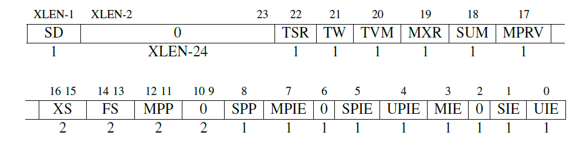

# PA1 实验报告

**实验进度**：我完成了所有必做题和选做题，除了“为什么要使用无符号类型? (建议二周目思考)”。

注：实验报告中有英文内容因为是从已写好的 ysyx 实验报告中复制过来的。

## 必做题

### 尝试理解计算机如何计算

计算机究竟是怎么通过这种既简单又笨拙的方式来计算1+2+...+100的?

> 答：编译器负责将程序分解为最小的原子操作，即指令，处理器有能力直接执行指令；

### 从状态机视角理解程序运行

> (0,x,x)->(1,0,x)->(2,0,0)->(3,0,1)->(2,0,1)->(3,0,1)->(2,0,1)->...
>
> 注：$1+\cdots+100$ 程序的状态机见下文。

### 优美地退出

> 答：当 MENU 初始化时，`nemu_state.state == NEMU_STOP`。当我们直接键入 `q` 退出，程序没有执行到 `HIT GOOD TRAP` 时，`nemu_state.state` 不会改变。而 `NEMU_STOP` 状态会被 `is_exit_state_bad()` 判断为异常退出，最终经 `main()` 返回 `1`。
>
> 解决方法是修改 `cmd_q()` 函数：
>
> ```c
> static int cmd_q(char *args) {
>   nemu_state.state = NEMU_QUIT;
>   return -1;
> }
> ```

### 实现单步执行, 打印寄存器, 扫描内存

> 答：功能已实现。

### 实现算术表达式的词法分析

> 答：功能已实现。

### 实现算术表达式的递归求值 & 实现带有负数的算术表达式的求值 (选做)

> 答：功能已基本实现，但是不太理解实验要求：前文说要实现带有负数的算数表达式，但是后文说都是无符号数运算，那么带有负数的表达式中，负数一开始就会被转换成相反数对应的无符号数。
> 
> 我没有使用 PA 讲义的方式实现该功能。我使用的方法是双栈法，关于双栈法的笔记放在了实验讲义的最后作为附录。
> 
> UPD 2023-09-14：带负数求值还是有缺陷，形如 `+-1`，`-+1`，`+++++------1`，`+++---++1` 等表达式仍然不能正确解析，使用双栈法似乎很难修复这个 bug，只能暂时希望用户不会输入如此不寻常的表达式。与此同时，经过尝试，三目运算符似乎不可能用双栈法实现。

### 扩展表达式求值的功能

> 答：功能已实现。

### 实现监视点池的管理 & 实现监视点

> 答：功能已实现。

### 尝试通过目录定位关注的问题

> 答：阅读 INTEL 80386 手册 p96 5.1.3 Selectors 节的内容。

### 程序是个状态机

画出计算 $1+2+\cdots+100$ 的程序的状态机。

> 答：设 (pc, r1, r2) 为状态。
>
> (0, x, x) -> (1, 0, x) -> (2, 0, 0) -> (3, 0, 1) -> (4, 1, 1) -> (2, 1, 1) -> (3, 1, 2) -> (4, 3, 2) -> (2, 3, 2) -> (3, 3, 3) -> (4, 6, 3) -> ... -> (2, 4851, 98) -> (3, 4851, 99) -> (4, 4950, 99) -> (2, 4950, 99) -> (3, 4950, 100) -> (4, 5050, 100) -> (5, 5050, 100);

### 理解基础设施

> 答：$500\times 90\% \times 30 \times 20 = 75$（小时）。节省 $50$ 小时。

### RTFM

> - riscv32 有哪几种指令格式?
> 
>     答：6 种，分别是 R, I, S, U, B, J 型。
>
> - LUI 指令的行为是什么?
> 
>     答：将符号位扩展的 20 位立即数 $immediate$ 左移 12 位，并将低 12 位置零，写入 $x[rd]$ 中。$x[rd] = sext(immediate[31:12] << 12)$
>
> - mstatus 寄存器的结构是怎么样的?
> 
>     答：mstatus（Machine Status）它保存全局中断使能，以及许多其他的状态，如图所示。
>     
>     

### Shell 命令

> 答：在 PA1 完成后
> 
> ```shell
> $ find . -name '*.c' -or -name '*.h' | xargs cat | wc -l
> 24542
> $ find -name '*.[ch]' -print0 | xargs -0 grep -v '^[[:space:]]*$' | wc -l
> 21258
> ```
>
> 行数：24542，非空行数：21258。
>
> 返回到 PA0
>
> ```shell
> $ git switch pa0
> Switched to branch 'pa0'
> $ find . -name '*.c' -or -name '*.h' | xargs cat | wc -l
> 23799
> ```
>
> 行数：23799。

### RTFM

> 答：`-Wall` 会使 GCC 报告所有的 Warning，`-Werror` 会使 GCC 将所有 Warning 视为 Error 而停止编译。组合使用 `-Wall`，`-Werror` 能够使得有 Warning 的程序不能通过编译，由于编译器也能发现代码中的一些未定义行为，能够在编译时刻把潜在的 fault 直接转变成 failure。这样能够提高代码的质量，使得用在 Debug 上的时间大幅减少。

## 选做题
 
### Kconfig 生成的宏与条件编译

这些宏的功能非常神奇, 你知道这些宏是如何工作的吗?

> 答：Firstly, When a macro `IF%` is expanded, it is expanded to `MUX%`. The details of `MUX%` is explained in the next paragraph. The function of `MUX%` is to choose from the two options followed in the argument list according to the property of the macro. `IF%` is defined to `__KEEP` or `__IGNORE`, which are simple macros to keep (simply expand to the argument) or ignore (to discard the argument).
>
> Secondly, how does `MUX%` determine the state of the macro? In `MUX_MACRO_PROPERTY`, the property is concatenated in the macro name through macro `MUX_WITH_COMMA` and `CHOOSE2nd` (in concatenation, a comma is added after the property, thus CHOOSE2nd will choose code snippet X when the property is defined, else Y);

### 为什么全部都是函数?

相比之下, 在这里使用函数有什么好处呢?

> 答：
> 1. The function `init_monitor` is better structured and more human readable to use function calls.;
> 2. The init implementations of each module should be written in its own file, not monitor.c. This approach ensures that the abstraction layer is not broken.;

### 参数的处理过程

另外的一个问题是, 这些参数是从哪里来的呢?

> 答：From the command line, which are first processed by the shell. Then the shell `fork()`, `execve()`, and passes the arguments to the program.

### 究竟要执行多久?

> 答：Forever, for -1 is 0xffffffff (int), and the argument type is uint64_t. It'll be converted to 0xffffffffffffffff (uint64_t) (roughly +inf).

### 潜在的威胁 (建议二周目思考)

> 答：This is not an undefined behaviour.
>
> According to ISO/IEC 9899:201x (p51, pdf p69), 6.3.1.3.2, "Otherwise, if the new type is unsigned, the value is converted by repeatedly adding or substracting one more than the maximum value that can be represented in the new type until the value is in the range of the new type.".
>
> 我的中文理解为：“将原值（将原变量的比特序列按原类型，数学意义上的值）重复执行（数学意义上的）加或减（新类型值域上界加1）这个值，直到这个值落在新变量的值域中。”
>
> 因此，传入 -1 时，将这个值加 $2^64$ 得 $2^64 - 1$，即为 `UINT64_MAX`。

### 谁来指示程序的结束?

> 答：The main function is called by `_start()`, which receives the return value and perform some clean up. When `main()` returns or `exit()` is called, the registered `atexit()` functions (the maximum number is at least 32) are called in the invert sequence that they are registered.
> 
> I can prove that by using GDB, using `bt` and `step`.

### 有始有终 (建议二周目思考)

> 答：#TODO (TAs: 请暂缓评分，这份实验报告将会在 2023-09-25 前更新)。

### 如何测试字符串处理函数?

> 答：最初，我的想法是把我以前写过的一些使用了字符串处理函数的程序移植到 klib (native) 上，然后运行它们来测试。
>
> 然后，我在 8 月初学习 java 时了解了单元测试及其思想，觉得可以写一些单元测试来帮助测试，问题是单元测试也不可避免地依赖 klib，似乎没有什么好的解决方法。
>
> 最后，做到 Difftest 阶段时，想到可能有办法将 klib 和 glibc 的行为相互比较（在函数的层面上，在 C 语言标准的层面上，不是在指令的层面上）。这个想法还没有实现。


### 为什么 `printf()` 的输出要换行?

> 答：这是一种“责任分配的规定”。首先，输出内容需要分行，如果不分行，输入内容会十分混乱。其次，两次连续输出必有一次需要在间隔中输出换行。在每次输出结束后换行是更符合实际的方法。当终端初始化时，光标在左上角（相当于已经换行），所以将负责换行的责任分配给前一次输出更合适。综上，`printf()` 的输出需要换行。

### 表达式生成器如何获得 C 程序的打印结果?

> 答：首先，通过 `popen()` 运行并打开对编译好的求值程序 `/tmp/.expr` 的 `stdin` 的只读管道，然后，用 `fscanf()` 读取结果，最后，用 `pclose()` 关闭管道。

### 为什么要使用无符号类型? (建议二周目思考)

> #TODO （暂时不会）

### 除 0 的确切行为

>  答：由于我解决除 0 的方法和 std 很可能不一样，所以这道题的回答也可能不一样。首先，修改表达式生成器使用的编译命令（加上 `-Werror`）后，求值程序不会有除 0 的行为（如果有除 0 行为，则编译出错，返回值不为 0，进入下一循环）。假设有除 0 的行为，则管道会关闭，`fscanf()` 将读取到 `EOF`。于是 `result` 将为未定值，而 `ret` 根据 `man fscanf`，将是 `EOF` (在 GCC `stdio.h` 中被定义为 `-1`)。这次的未定值结果会被输出。
> 
> 注：在 sdb 的表达式求值中，我规定除 0 是 UB，如果真的有除 0 行为，求值过程的这一步将会返回 0 作为结果，不会崩溃。

### 实现表达式生成器

> 答：功能已实现。

### 温故而知新

> 答：使得 `wp_pool` 等标识符的作用域为文件作用域（`wp_pool` 等在可重定位目标文件中将作为局部符号而不是全局符号）。

### 你会如何测试你的监视点实现?

> 答：等到完成 PA2，NEMU 可以运行较大型的程序时，可以利用在 `nemu-main.c` 中编写的测试框架，增加几个测试，测试 3 种操作：寄存器修改，内存修改，增加 Watchpoint 数量到 32 个，缩减到 0 个。

### 强大的GDB

> 答：GDB 能够提供：
> 1. 程序收到的信号：SIGSEGV；
> 2. 程序除法段错误的位置；
> 3. 出错时的调用堆栈，以及各个参数被调用时传入的参数，便于复现错误（如果关闭 NEMU -O2 编译选项的话）；

### 如何提高断点的效率 (建议二周目思考)

> 答：原因是每次运行都需要匹配正则表达式，还要进行其他大量的字符串解析。解决方法是在 `struct watchpoint` 中存解析过的 `Token` 数组（其实 `Token` 也可以加优化，比如常数数值类型直接存数值），或者更加优化，存表达式树。

### 一点也不能长?

> 答：是的，因为 `int3` 指令用于自陷，调用调试器（细节已写在下文中）。如果 `int3` 不是所有指令中最短的，那么必然有指令不能被替换为 `int3` 指令（只能覆盖断点所在的那条指令，可以构造出替换两条以上指令使得原程序逻辑被破坏的指令序列），这对调试器实现软件断点造成巨大困难。在 my-x86 中，使用 NEMU 的断点方法仍然是可行的，因为 NEMU 监视点不是通过指令替换方法实现的。如果只写 `==` 用作断点，还能够正常工作，因为 `$pc` 必然有一个时刻指向该指令的起始地址。

### 随心所欲的断点

```objdump
$ objdump -d a
    121c:	48 89 c7             	mov    %rax,%rdi
    121f:	e8 cc fe ff ff       	call   10f0 <popen@plt>
```

```gdb
(gdb) hbreak *0x121e
Hardware assisted breakpoint 2 at 0x121e
(gdb) c
Continuing.
[Detaching after vfork from child process 230529]
100 -1
[Inferior 1 (process 230517) exited normally]
(gdb) 
```

> 答：如上所示，监视点不能正常工作，因为 $pc ($eip) 没有一个时刻的值等于 0x121e。想要规避这一点，可以使用 `watch $pc >= 0x121c && $pc < 0x121f`。

### NEMU 的前世今生

> 答：Emulator 是用一种软硬件平台模拟另一种软硬件平台行为的软硬件。Debugger 是调试工具。Debugger 可以通过实现 Emulator 来实现，也可以纯硬件实现或软硬结合实现。关于 Emulator 和 Debugger 有什么不同，我以前阅读过一个程序分析工具 Valgrind 的介绍。其中，Valgrind 实际上是内置了一个软件实现的 CPU，来检测如多线程访问冲突等软件难以捕捉的问题，这实际上是实现了 Emulator 的功能，但是 Valgrind 是一个用于检查软件问题的 Debugger。GDB 实现打软件断点的方式是偷梁换柱：将断点处的指令换成一条自陷指令，在 x86 平台上是 `int3`，在一些平台上支持设置硬件断点。当执行到这条指令时，进入异常处理，GDB 被调用，然后将原指令复原，待用户继续程序执行后从原位置继续运行。相较而言，NEMU 的 sdb 是通过不断对表达式求值来设置断点的。
