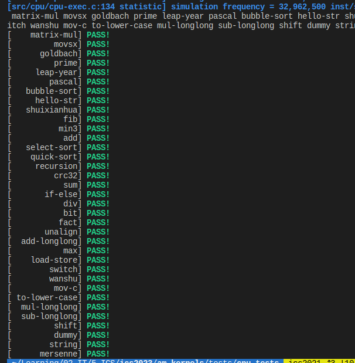
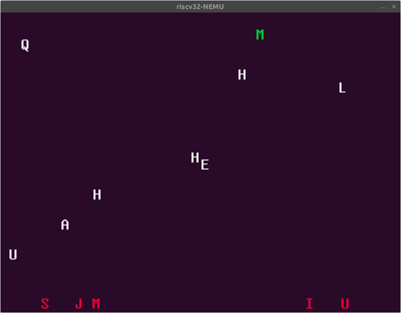
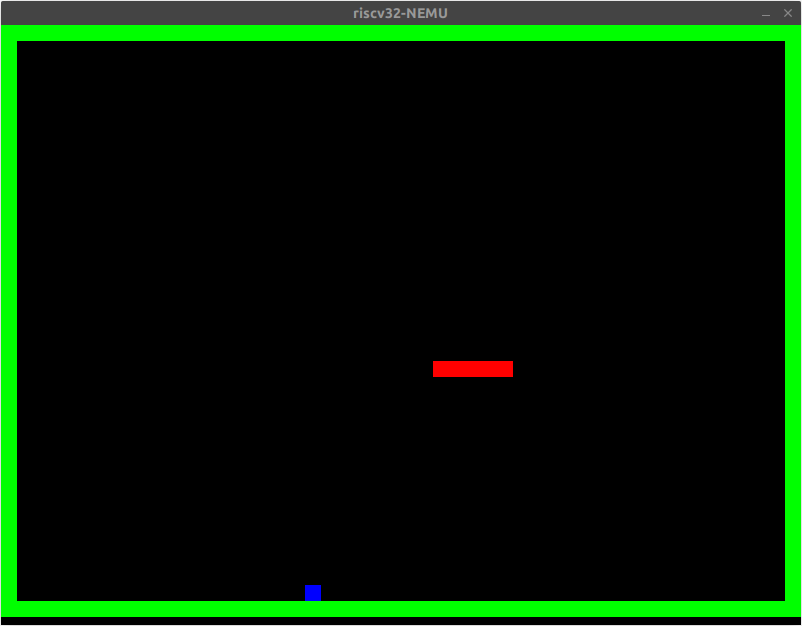
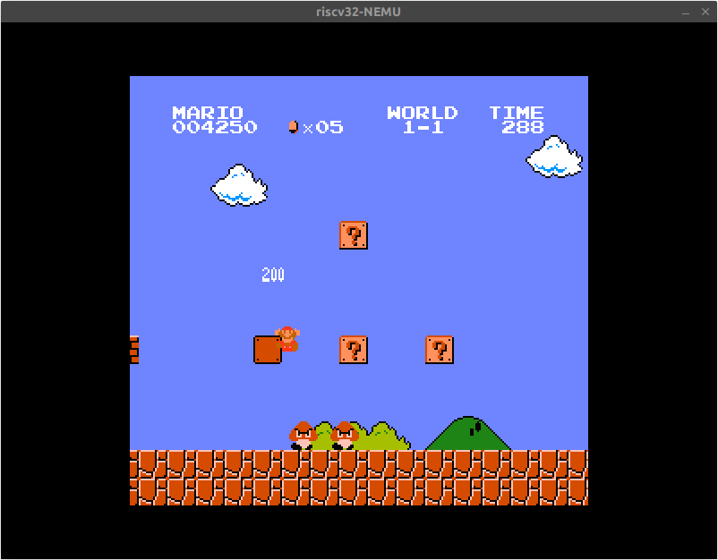

# PA2 实验报告

**实验进度**：我完成了所有必做题和部分选做题。

## 必做题

### 理解YEMU如何执行程序

1. 加法程序的状态机

> State ID | PC | Reg         | Mem  
> 0          00   00 00 00 00   E6 04 E5 11 F7 10 21 00 00 00 00 00 00 00 00 00  
> 1          01   21 00 00 00   ...  
> 2          02   21 21 00 00   ...  
> 3          03   10 21 00 00   ...  
> 4          04   31 21 00 00   ...  
> 5          05   31 21 00 00   E6 04 E5 11 F7 10 21 31 00 00 00 00 00 00 00 00  
>   
>   
> Graph  
> 0 -> 1 -> 2 -> 3 -> 4 -> 5  

2. YEMU 如何执行一条指令

> 首先，在 `main` 中通过死循环不断执行指令，如果停机，则退出循环。
> 
> 每次通过 `exec_once` 执行一条指令。其中，先取指，然后译码，然后执行。
>
> 取指过程，因为 YEMU 为定长指令字架构，定义了 `inst_t`，用“位域”这一 C 语言特性，简化了译码的操作。
> 执行后，因为 YEMU 没有跳转指令，所以 `pc ++`。

两者间关系：YEMU 执行指令的过程，就是状态间转移的过程。

### RTFSC理解指令执行的过程

> 以下对指令执行的分析，从 `nemu/src/cpu/cpu-exec.c:exec_once` 开始。
>
> 首先，在 `nemu/src/cpu/cpu-exec.c:execute` 中已经被创建好的 `Decode` 类型结构体和当前 `pc` 被传入 `exec_once` 中。`exec_once` 根据接下来 `isa_exec_once` 的结果 `dnpc`（保存在 `Decode s` 中），更新全局变量 `cpu` 中 `pc` 的值。这是更新 PC 的步骤。
>
> 然后，取指阶段，译码阶段执行阶段因为和 ISA 相关，抽象在 `nemu/src/isa/riscv32/inst.c:isa_exec_once` 中。先进行 `inst_fetch` 取指令，然后调用 `decode_exec` 进行译码和执行。
>
> 取指的细节：`inst_fetch` 通过调用 `vaddr_ifetch` （猜测和后面支持虚拟内存有关，现在仅仅是直接转发到 `paddr_read` 直接读内存），在虚拟地址里取了指令，然后更新 `pc`。如果是 x86，变长指令字的支持在这里完成。
> 
> 执行的细节：在 `decode_exec` 中，首先解析出 `imm`，`src1`，`src2` 的值，然后匹配指令，执行对应的模拟代码。这里要特别感谢 yzh 老师重构的框架，`INSTPAT` 宏为我们添加指令提供了极大方便，而且没有降低运行效率。

### 实现更多的指令

目前已经实现了除了异常处理外的 RISC-V32IM 所有指令，通过了 `alu-test` 和所有 `cpu-test`（写这篇实验报告时已经完成了 klib 和 ioe）。

能够正确运行 typing-game，snake，mario 等。

## 选做题

### 立即数背后的故事

#### 假设我们需要将 NEMU 运行在 Motorola 68k 的机器上(把 NEMU 的源代码编译成 Motorola 68k 的机器码)

> 当需要把 NEMU 移植到 Motorola 68k 处理器的机器上时，需要在运行为小端ISA 编译的程序时转换端序，包括指令字节顺序的转换和数据字节顺序的转换。因为为小端ISA 编译的程序目标文件中的指令和数据是按小端存放的，加载到内存时需要改变字节序。可以添加条件编译，使得 paddr_read 函数按需在读取时转换字节序，paddr_write 函数在写入时也改变字节序；

#### 假设我们需要把 Motorola 68k 作为一个新的 ISA 加入到 NEMU 中

> 当需要把 Motorola 68k 作为新的 ISA，且 NEMU 在小端机器上运行时，也需要转换。原因相同。解决方法也相同；

#### mips32 和 riscv32 应该如何解决把 C 代码中的 32 位常数直接编码到一条指令中的问题

> 寄存器的长度是足够的。寄存器的编号也是可以直接在指令中表示的。可以使用多条指令在寄存器中拼出一个完整的立即数。
>
> 具体地，在 riscv32 中，有 `lui`指令，可以加载高 20 位的立即数，而在 I, S. B, 指令中，可以存放 12 位立即数，这样就可以拼出 32 位立即数。比如，先 `lui`，然后用 `addi` 指令，加上低 12 位（有一些和立即数符号扩展相关的细节需要处理）。这两步被抽象成伪指令 `li`。如果想要生成一个 32 位的地址，也有 `auipc` 等指令可以使用。

### 为什么执行了未实现指令会出现上述报错信息

> 如果有没有实现的指令，那么指令执行阶段在 `decode_exec` 中会匹配到 `inv` 指令。这一条指令对应的执行代码最终调用了 `nemu/src/engine/interpreter/hostcall.c:invalid_inst`，然后这个函数会输出这个报错信息并设置 NEMU 状态为 `ABORT`，退出。

### mips32 的分支延迟槽

> 
