# PA3 实验报告

**实验进度**: 我完成了所有的必做题和大部分选做题。

## 必做题

### 重新组织 Context 结构体 理解上下文结构体的前世今生 理解穿越时空的旅程

由于现阶段没有外部中断，接下来的回答是从用户程序 `ecall` 一直到用户程序得到系统调用返回值的过程。`yield test` 的内容在其中用黑体标出。

#### 初始化阶段

1. 系统级程序（Nanos-lite）：`nanos-lite/src/irq.c:init_irq`，`cte_init(do_event)` 在 AM 中注册系统调用处理函数 `do_event`；
2. AM：`abstract-machine/am/src/riscv/nemu/cte.c:cte_init`，设置 AM 的处理函数 `asm volatile("csrw mtvec, %0" : : "r"(__am_asm_trap));`，注册操作系统的处理函数 `user_handler = handler;` 异常处理时，NEMU 将先跳转到 `__am_asm_trap`，然后经转发，将上下文结构体指针传递给操作系统的处理函数。
3. NEMU：`csrw mtvec, %0`，将 `mtvec` 设置为 AM 处理函数。

**`yield()`**：注册的 `user_handler` 是 `am-kernels/tests/am-tests/src/tests/intr.c:simple_trap`；

#### 运行阶段

1. 用户级程序（Navy Apps）：libc 最终调用 libos，libos 在寄存器中设置好系统调用号和参数 

    ```c
    // navy-apps/libs/libos/src/syscall.c
    asm volatile (SYSCALL : "=r" (ret) : "r"(_gpr1), "r"(_gpr2), "r"(_gpr3), "r"(_gpr4));
    ```

    执行 `ecall` 指令，开始系统调用；

    **`yield()`**：即为 `li a7, -1; ecall`。开始自陷。

2. NEMU：CPU 自动跳转到 `mtvec` 中 `__am_asm_trap` 的位置执行

    根据手册，CPU 自动经历如下状态转换
    1. `mstatus` 更改权限模式，关中断：将异常前的权限保存到 `mstatus.MPP`，将 `mstatus.MIE` 保存到 `mstatus.MPIE` 后置零（保存中断状态，关中断）；
    2. `mcause` 设置异常来源，`mtval` 写入附加信息（后者 PA 忽略），`ecall` 指令产生的异常号我的实现中为 11；
    3. `mepc` 保存异常前 `pc`。
    4. 跳转到 `mtvec`。

    ```c
    // nemu/src/isa/riscv32/inst.c
    INSTPAT("000000000000 00000 000 00000 11100 11", ecall   , I,
        isa_raise_intr(11, s->pc);
        s->dnpc = C(CSR_MTVEC_IDX);
    );
    ```

    在我的实现中，根据 PA 的要求，只实现了 M-Mode，所以异常号为 11 （Environment Call from M-Mode）。

    ```c
    // nemu/src/isa/riscv32/system/intr.c:isa_raise_intr
    #ifdef CONFIG_ETRACE
    if (ETRACE_COND)
        Info("[etrace] Exception No.%d at epc: 0x%x", NO, epc);
    #endif
    
    C(CSR_MEPC_IDX) = epc;
    C(CSR_MCAUSE_IDX) = NO; // use Exception-from-M-mode
    word_t mstatus = C(CSR_MSTATUS_IDX);
    word_t mie = getbit(mstatus, 3);
    mstatus = (mie) ? setbit(mstatus, 7) : rstbit(mstatus, 7);
    mstatus = rstbit(mstatus, 3);
    C(CSR_MSTATUS_IDX) = mstatus;
    
    return epc + 4;
    ```

    **`PC + 4` 的处理**：`ecall` 指令存的是 `pc` 而不是 `pc + 4`，`+4` 的操作是由 AM 的异常处理程序进行的。在下一条详细展开。

3. AM 封装事件为 `Context` 结构体，转发事件

    NEMU 自动跳转到 `abstract-machine/am/src/riscv/nemu/trap.S:__am_asm_trap`，开始保存现场到 `Context` 结构体

    ```asm
    addi sp, sp, -CONTEXT_SIZE

    MAP(REGS, PUSH)

    csrr t0, mcause
    csrr t1, mstatus
    csrr t2, mepc

    STORE t0, OFFSET_CAUSE(sp)
    STORE t1, OFFSET_STATUS(sp)
    STORE t2, OFFSET_EPC(sp)
    ```

    从低地址到高地址，分别是 `x0` ~ `x31`, `mcause`, `mstatus`, `mepc`（实际上没有保存和恢复 `x0`, `x2`）。

    所以 `Context` 结构体重构如下

    ```c
    struct Context {
        uintptr_t gpr[NR_REGS];
        uintptr_t mcause, mstatus, mepc;

        void *pdir;
    };
    ```

    **`PC + 4` 的处理**：在 `abstract-machine/am/src/riscv/nemu/cte.c:__am_irq_handle` 中，判断如果是自陷异常，则将 `pc + 4`。这里有一个小问题还没有解决：`+4` 操作是在调用用户处理函数之前还是之后？我的实现是在调用之前（AM 的文档中没有写这个操作是由 AM 做还是操作系统做，以后可能需要调整）。

    `__am_irq_handle` 判断异常号

    ```c
    switch (c->mcause) {
        case 11:
            if (c->GPR1 < 20) ev.event = EVENT_SYSCALL;
            else ev.event = EVENT_YIELD;
    ```

4. 系统级程序（Nanos-lite）：从 `GPR1`, `GPR2`, `GPR3`, `GPR4` 中取出调用号和参数，开始系统调用，返回值存 `GPRx`；

5. AM `__am_asm_trap` 存修改后的现场（`pc + 4` 被写入 `mepc`） `mret`；

6. NEMU 跳转到 `mepc` 位置，即原用户程序 `ecall` 的下一条指令，用户程序获得系统调用返回值。

### 实现异常响应机制 识别自陷事件 恢复上下文

在实现 RISC-V 的异常相应机制时，花费了不少时间，主要是不清楚“不需要关心特权级切换相关的内容”后，究竟应该怎样操作 `mstatus` 寄存器中的各种标志位。

```
Hello, AM World @ riscv32
  t = timer, d = device, y = yield
yyyyyyyyyyyyyyyyyyyyyyyyyyyyyyyyyyyyyyyyyyyyyyyyyyyy
```

#### 参考资料
- [1] RISC-V Vol.2
- [2] [RISC-V 异常处理流程介绍](https://tinylab.org/riscv-irq-pipeline-introduction/)
- [3] [X2W第六次组会：异常委托机制](https://www.bilibili.com/video/BV1aP411R7dM/?spm_id_from=333.788.recommend_more_video.4)
- [4] https://www.bilibili.com/video/BV11M4y1t7nv/?spm_id_from=333.999.0.0

### 实现 etrace  实现 strace

etrace 已实现，在 NEMU 的 Kconfig 中启用；
strace 已实现，在 NanOS-lite 的 `debug.h` 中启用 `ENABLE_STRACE` 宏启用，实现了针对文件系统的可读性优化功能。

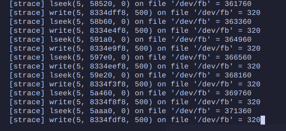

### 实现堆区管理

做 PA 前，我以为堆区管理需要手写 `malloc` 的算法，现在发现那是 C 库的工作。

### hello 程序是什么, 它从而何来, 要到哪里去

#TODO

### 把按键输入抽象成文件

`/dev/events` 的设计包含了各种大坑，在后续的实验中我犯了许多错误，包括但不限于

1. 忘记删除事件末尾的 `\n`，Debug 3h；
2. 由于不会正确使用 `sprintf` 和 `sscanf` 在 NDL 中手写事件解析器（后来改回了 `sscanf`）；
3. 没有考虑键值对的顺序可能不同，在 Native 上 Crash，Debug 1h；
4. ...

### 实现 `gettimeofday`

我终于解决了 NEMU 时钟的 Bug！问题在于 `AM_TIMER_UPTIME` 寄存器为 64 位，需要分两次读取，然而 NEMU 是在读取高 32 位时更新寄存器值。我的 AM 实现是先读低 32 位，再读高 32 位。

PA2 的 OJ 没有测试时钟的实现，实际上我没有解决 NEMU 在时钟部分的问题。在 YSYX 的组会上，一位同学提到他没有修改相关代码，但是结果仍然正确。助教提到坑和寄存器有 64 位有关。我这才想到问题的原因。（2023.11.06 修复了这个问题并更新了 PA2 实验报告）

### 实现更多的 fixedptc API

已为 libfixedptc 库编写测试，位于 `navy-apps/tests/fixedptc-test`

### 运行 NSlider

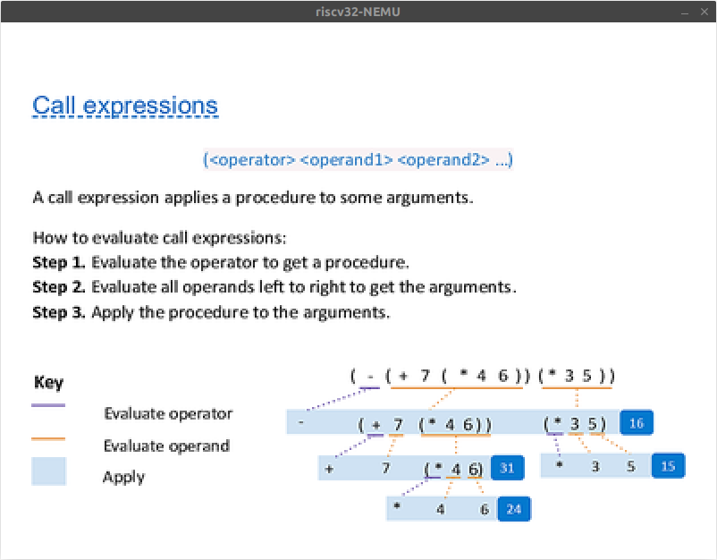

### 运行 NTerm

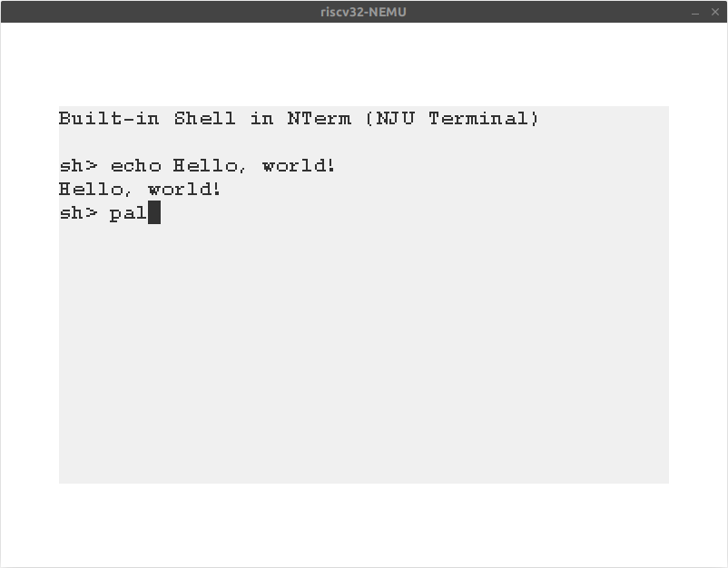
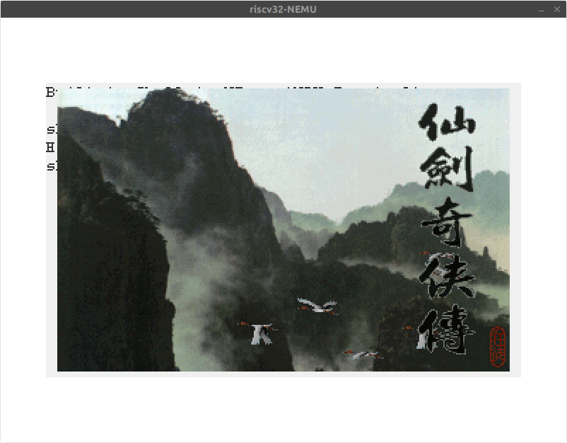

### 运行 Flappy Bird


### 运行仙剑奇侠传

一开始，我调色板的像素格式没有进行转换，造成仙剑呈蓝色

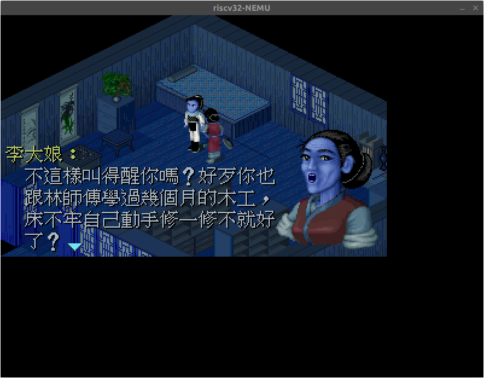

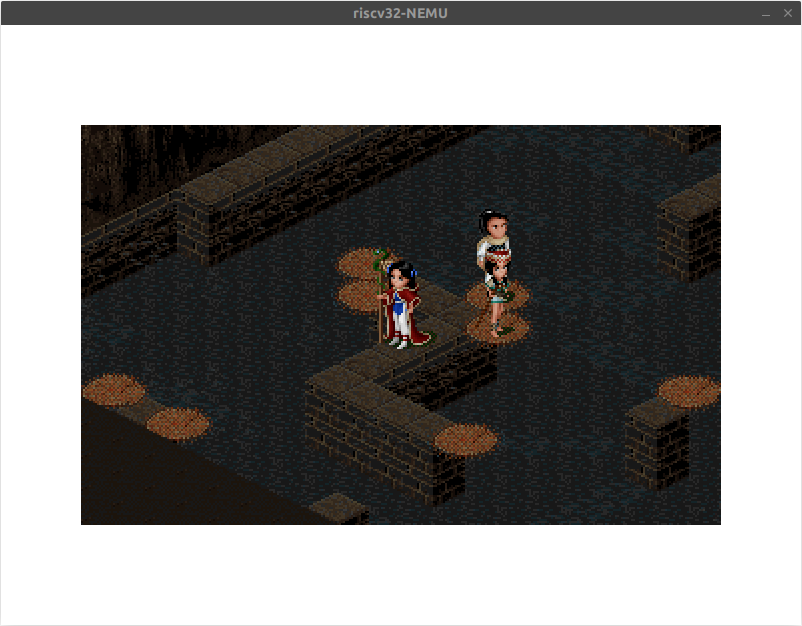
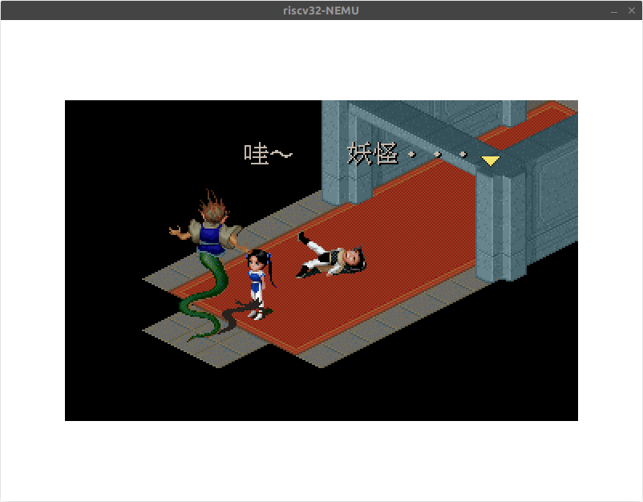
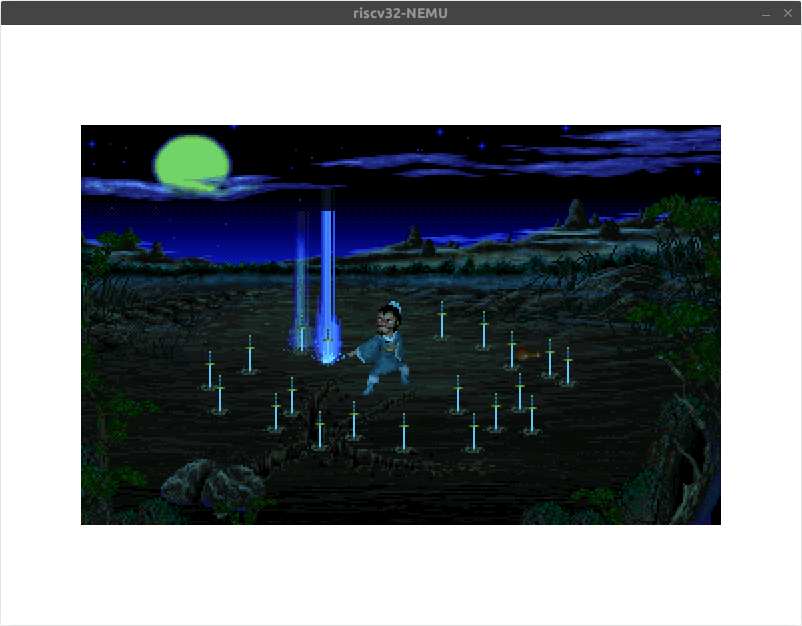
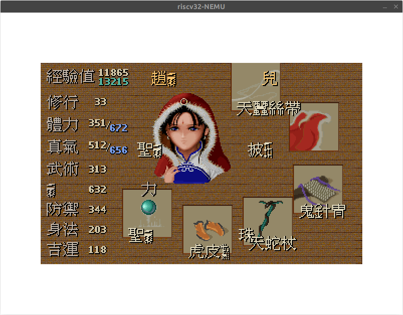
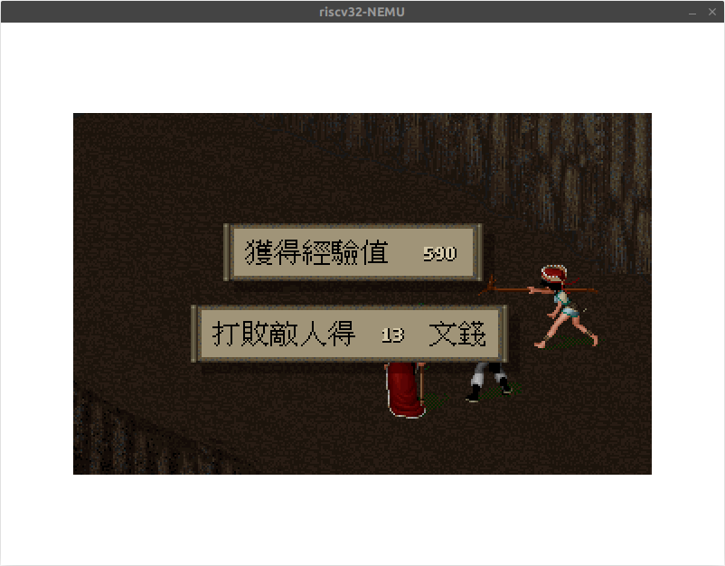
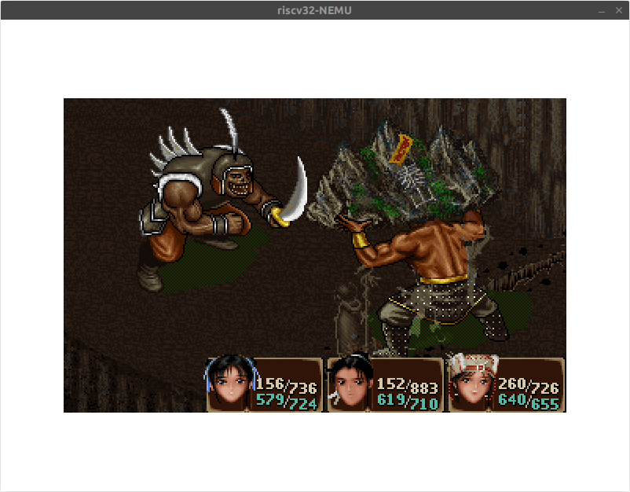
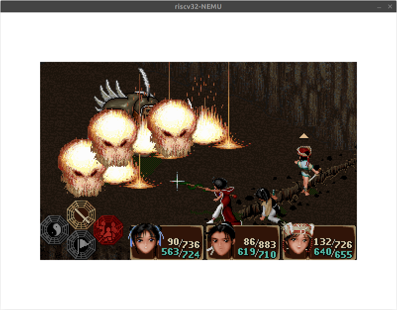

目前仙剑的字体渲染仍然有问题，还没有 Debug。

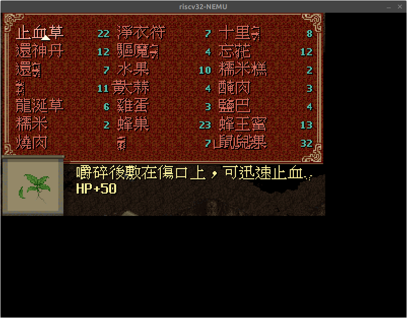

#TODO

## 选做题

### 什么是操作系统? (建议二周目思考)

操作系统是位于 ISA 和用户应用程序中间的抽象层，包含加载器、文件系统、进程调度、驱动程序等部分。

### 异常号的保存

#TODO

### 对比异常处理与函数调用

异常处理保存的上下文比函数调用多了函数调用没有保存的通用寄存器和各种控制状态寄存器。原因是：异常处理的目的是

### 从 `+4` 操作看 CISC 和 RISC


### 堆和栈在哪里?

堆和栈是程序运行时创建的，自然不会放入可执行文件里面。

在 AM 中，栈实际上就是从一个指定的内存位置 `_start_pointer` 开始的。在 `abstract-machine/scripts/linker.ld` 中，指定了初始的栈顶指针在 `.bss` 段后 4KB 对齐加上 32KB 的位置。堆区从栈区后 4KB 对齐的位置开始。

```ld
  _stack_top = ALIGN(0x1000);
  . = _stack_top + 0x8000;
  _stack_pointer = .;
  end = .;
  _end = .;
  _heap_start = ALIGN(0x1000);
```

### 如何识别不同格式的可执行文件?

1. 通过 Magic Number 判断是否为 ELF 文件；
2. 通过解析 Elf_Header 判断 ELF 文件运行的平台是否正确。

### 冗余的属性? 为什么要清零?

ELF 可执行文件（程序）是内存中的进程的映像，文件中 `FileSiz` 的大小不一定和内存 `MemSiz` 中的大小相同，需要初始化的部分需要在文件中保存，而没有初始化的内存区域无需保存。比如 `.bss` 节，是 C 中未初始化的全局变量的内存区域。C 标准规定，没有初始化的全局变量内存区域初始化为 0。

### 检查 ELF 文件的魔数  检测 ELF 文件的 ISA 类型

已完成。

### 系统调用的必要性

如果批处理序列中的每一个程序都知道下一个加载的程序是哪一个（而且也能够将下一个程序正确加载），我认为可以不需要系统调用（不需要操作系统），也可以把 AM 的 API 暴露给批处理系统中的程序。

如果规定是由操作系统来加载程序，那么系统调用是必须的。因为想要达到批处理系统的效果，一个程序结束后必须有方法告知操作系统，只有系统调用才能实现这一点。

### RISC-V 系统调用号的传递

在 RISC-V ABI 中，规定 `a0` 寄存器作为第一个参数和返回值的寄存器，如果在 `a0` 中放置系统调用号，那么第一个参数将被覆盖。我猜想是为了让系统调用参数传递和普通参数传递保持一致，将系统调用号的转递放到了 `a7`。

### 实现居中的画布

已实现。

### 比较 `fixedpt` 和 `float`

这意味着我们假定需要表示的数、运算的中间结果不会太大也不会太小，具体地，正数在 $[2^{-8}, 2^{23})$ 范围内，而且对计算精度要求不太高。

### 神奇的 `fixedpt_rconst`

实际上，乘法的操作数 `FIXEDPT_ONE` 的类型是 `int32_t`。

### 如何将浮点变量转换成 `fixedpt` 类型?

因为该 `float` 真值落在了 `fixedpt` 可表示的范围中，所以不用考虑 NaN，Inf 还有非规格化浮点数。

以下为 `fixedpt_fromfloat(void *p)` 的实现。

#TODO

### 神奇的 `LD_PRELOAD`

这一题就是解析如何实现类似 `chroot ${NAVY_HOME}/fsimg` 的功能，下面以 `fopen` 的实现为例。

正常情况下，NAVY 应用程序调用 libc 的 `fopen`，然后 C 库将发起系统调用，调用 libos 中的 `_syscall_` 发起系统调用。在 native 上，如果系统调用被执行了，那么由于传递给 linux 的文件为相对于 `${NAVY_HOME}/fsimg` 不存在，文件将不能打开。`native.cpp` 的做法是在 C 库层面上劫持对 `fopen` 的调用，在程序给出的路径前加上前缀，然后转而使用 Glibc 的实现。

在 `navy-apps/libs/libos/Makefile` 中，定义了 `native.so` 的编译规则

```Makefile
build/native.so: src/native.cpp
	mkdir -p build/
	g++ -std=c++11 -O1 -fPIC -shared -o build/native.so src/native.cpp -ldl -lSDL2
```

在 `navy-apps/scripts/native.mk` 中，定义了 native 上的链接规则，设置了环境变量 `LD_PRELOAD`

```Makefile
run: app env
	@LD_PRELOAD=$(NAVY_HOME)/libs/libos/build/native.so $(APP) $(mainargs)
```

根据 [1]，“我们可以指定预先装载的一些共享库甚至是目标文件。在 `LD_PRELOAD` 里面指定的文件会在动态链接器按照固定规则搜索共享库之前装载，它比 `LD_LIBRARY_PATH` 里面所指定的目录中的共享库还要优先。无论程序是否依赖它们，`LD_PRELOAD` 里面指定的共享库或目标文件都会被装载”

根据动态链接的规则，在运行时动态链接 `fopen` 时，链接的是 `native.cpp` 中给出的 `fopen`（`native.cpp` 中写了 `extern "C"` 防止 C++ 函数名字改变）。

#### 参考文献
- [1] 8.5 环境变量 - 《程序员的自我修养》

### 实现内建的 `echo` 命令

已实现。

### 仙剑奇侠传的框架是如何工作的?

#TODO

### 仙剑奇侠传的脚本引擎

《仙剑奇侠传》是一个状态机😇。首先，开发者开发了游戏引擎（CPU），定义了各种事件和操作（ISA），实现了所有的事件处理函数（指令），然后为游戏编写脚本（程序）。

在 `navy-apps/apps/pal/repo/include/global.h` 中，定义了指令格式

```cpp
typedef struct tagSCRIPTENTRY
{
   WORD          wOperation;     // operation code
   WORD          rgwOperand[3];  // operands
} SCRIPTENTRY, *LPSCRIPTENTRY;
```

在 `navy-apps/apps/pal/repo/src/game/script.c` 中，这个巨大的 `switch` 就是指令译码（Opcode 部分）

```cpp
   switch (pScript->wOperation)
   {
   case 0x000B:
   case 0x000C:
   ...
   }
```

### 不再神秘的秘技

我没有玩过《仙剑》，只是负责让它跑起来。具体的细节可能需要查看 `.mkf` 中的二进制脚本才行。仔细检查了 PAL 中所有包含 `cash` 的代码，没有发现 bug。

```cpp
   case 0x001E:
      //
      // Increase or decrease cash by the specified amount
      //
      if ((SHORT)(pScript->rgwOperand[0]) < 0 &&
         gpGlobals->dwCash < (WORD)(-(SHORT)(pScript->rgwOperand[0])))
      {
         //
         // not enough cash
         //
         wScriptEntry = pScript->rgwOperand[1] - 1;
      }
      else
      {
         gpGlobals->dwCash += (SHORT)(pScript->rgwOperand[0]);
      }
      break;
```

以下是猜测

1. 第一个和第二个，似乎都是整数溢出 Bug。都是钱所剩无几，然后变为 SHORT 负数，转换过程中变为 DWORD，然后又转换成 int，就“暴增到上限了”；
2. 第三个实在不清楚；

### 实现 Navy 上的 AM

功能已实现。

### 在 Navy 中运行 microbench

在 am-kernel 的 Makefile 中加入 microbench，在 nterm 中启动，发现

```
======= Running MicroBench [input *ref*] =======
[qsort] Quick sort: Ignored (insufficient memory)
[queen] Queen placement: * Passed.
  min time: 592.000 ms [687]
[bf] Brainf**k interpreter: Ignored (insufficient memory)
[fib] Fibonacci number: Ignored (insufficient memory)
[sieve] Eratosthenes sieve: Ignored (insufficient memory)
[15pz] A* 15-puzzle search: Ignored (insufficient memory)
[dinic] Dinic's maxflow algorithm: Ignored (insufficient memory)
[lzip] Lzip compression: Ignored (insufficient memory)
[ssort] Suffix sort: Ignored (insufficient memory)
[md5] MD5 digest: Ignored (insufficient memory)
==================================================
MicroBench PASS        68 Marks
                   vs. 100000 Marks (i9-9900K @ 3.60GHz)
Scored time: 592.000 ms
Total  time: 596.000 ms
```

报错原因是 Insufficient memory，猜想和堆上的内存分配有关系（如果是栈空间不足，程序应该会出现访存越界，应该会在 NEMU 中出现非法指令、访存越界退出等反应）。在 3 个测试的文件夹下查找所有含有 `alloc` 的内容，发现只有 `microbench` 使用了堆内存。

在 `am-kernels/benchmarks/microbench/src/bench.c:bench_alloc` 中，获取了堆内存的大小

```c
void* bench_alloc(size_t size) {
  size  = (size_t)ROUNDUP(size, 8);
  char *old = hbrk;
  hbrk += size;
  assert((uintptr_t)heap.start <= (uintptr_t)hbrk && (uintptr_t)hbrk < (uintptr_t)heap.end);
  for (uint64_t *p = (uint64_t *)old; p != (uint64_t *)hbrk; p ++) {
    *p = 0;
  }
  assert((uintptr_t)hbrk - (uintptr_t)heap.start <= setting->mlim);
  return old;
}
```

然而，在加载 AM 程序的时候，实现的 libam 并没有发起系统调用管理分配堆内存，全局变量 `Area heap` 的 `start` 和 `end` 的值都是 0，所以报告内存不足。

修改 libam 的实现（由于 TRM 没有初始化函数，我在 IOE 的初始化中加入了堆的处理），在程序加载时申请足够大的堆内存（我的实现中申请了 64M），成功运行 microbench。

```c
bool ioe_init() {
  heap.start = sbrk(67108864); // 申请 64M 空间
  heap.end = sbrk(0);
  for (int i = 0; i < LENGTH(lut); i++)
```

### 运行 FCEUX

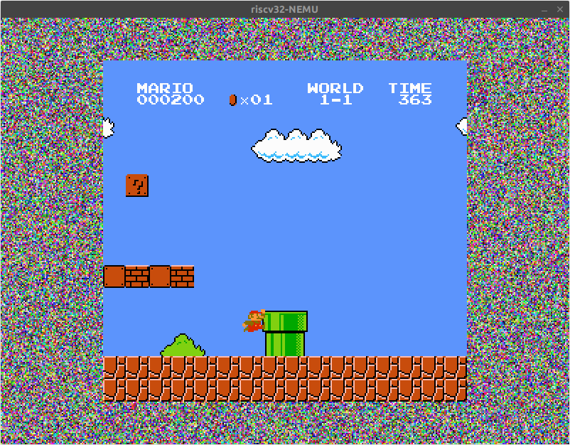

### 诞生于"未来"的游戏

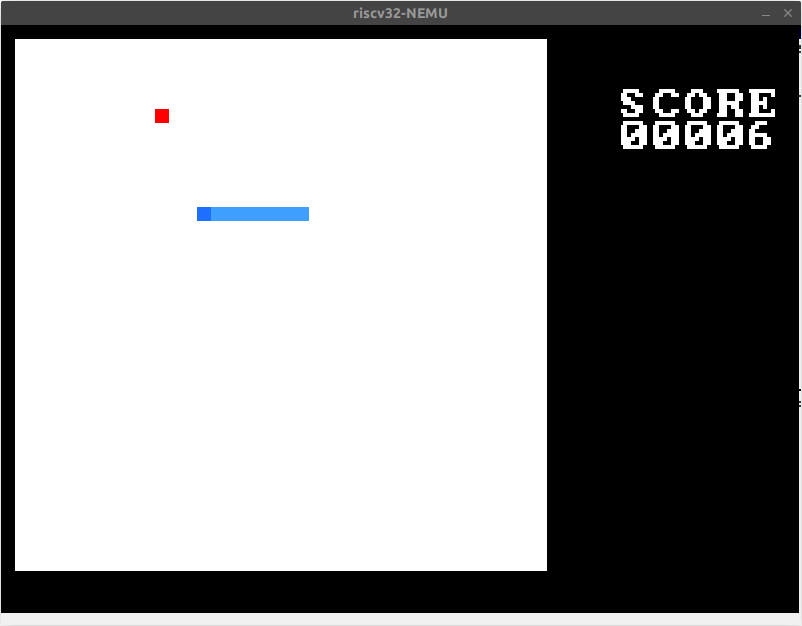
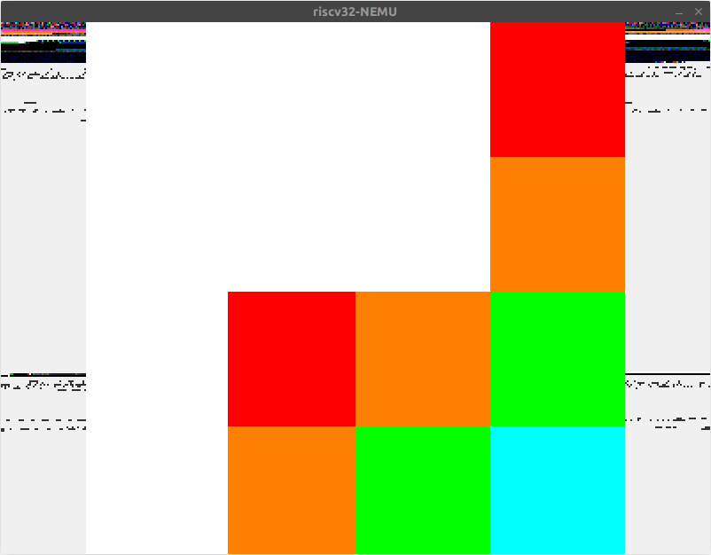
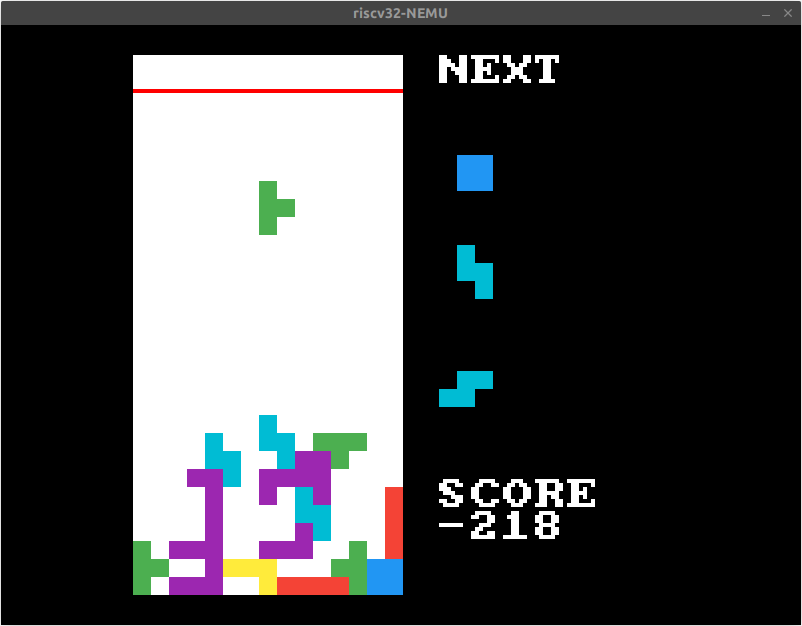

有一些程序不能正常运行，暂时没有 Debug。

UPD 2023.11.08：破案了，是没有为 AM 实现堆区，实现后都能正常运行了。

有一些程序初始化时花屏，将 libam 申请的内存置零，问题修复。

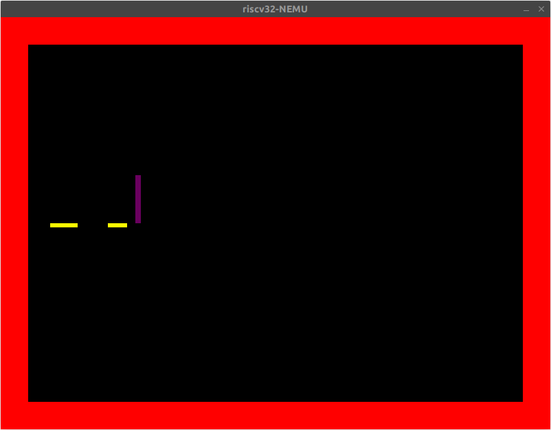
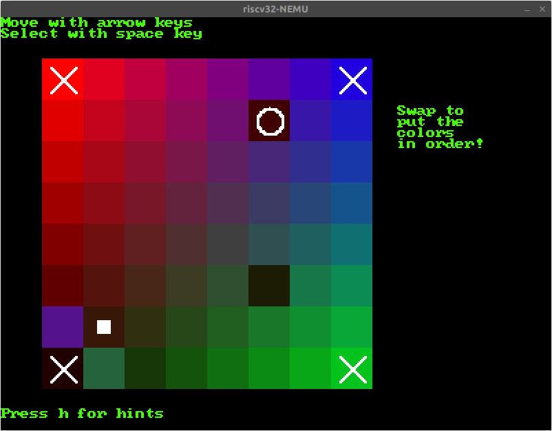

### RTFSC???

代码混淆技术肯定要使用 PA1 表达式求值中的 Tokenize 步骤的方法。我猜想也许可以让某个 C 编译器前端来帮我们做到这一点，然后将 AST 中的变量名修改一下，再转回 C 代码。

### 让运行时环境支持 C++ 全局对象的初始化

在 `call_main` 函数中插入对 `__libc_init_array` 的调用，已实现。

### 理解全局对象构造函数的调用过程

我没有按照讲义的方式完成这道题，之前在阅读 [1] 时，读到了 Glibc 和 GCC 如何协作完成 C++ 全局对象初始化，以下是结论。

`.init_array` 节是一个指针数组，是由每一个目标文件的 `.init_array` 节合并得到的。这个指针数组的每一个元素指向一个初始化函数。

STFW，根据 newlib 源码注释中的提示

```c
/* These magic symbols are provided by the linker.  */
extern void (*__preinit_array_start []) (void) __attribute__((weak));
extern void (*__preinit_array_end []) (void) __attribute__((weak));
extern void (*__init_array_start []) (void) __attribute__((weak));
extern void (*__init_array_end []) (void) __attribute__((weak));
```

使用 `readelf -P --string-dump=.rodata /usr/bin/ld | grep '__init_array_start' | uniq` 可以发现在 ld 的默认链接脚本中定义了 `__init_array_start`，指向的就是 `.init_array` 的起始位置。

所以，整个过程如下

1. nanos-lite 调用 `entry`，实际是 `start.S:_start`；
2. `_start` 调用 `call_main`；
3. `call_main` 调用 `__libc_init_array`，初始化全局对象；
4. `call_main` 调用 `main`；


#### 参考文献
- [1] [揪出gcc默认使用的ld链接脚本 - 龙图腾](https://blog.csdn.net/dragon101788/article/details/8080747)
- [2] 11.4 C++ 全局构造和析构 - 《程序员的自我修养》
