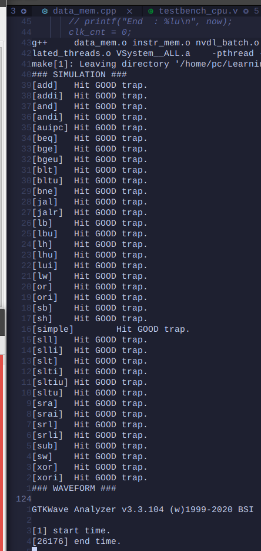

# RISwitch 软件仿真和配套开发环境

## 功能和环境要求

1. CPipe CPU RTL 生成
    - Ubuntu GNU/Linux 22.04
    - [mill](https://github.com/com-lihaoyi/mill): Scala/Chisel build tool
    - GNU Make

2. NVDL 仿真和虚拟上板
    - GCC >= 11
    - Verilator >= 5.014
    - GTKWave
    - Python3

3. AM 应用程序开发
    - LLVM >= 11
    - gcc-riscv64-linux-gnu (参照 PA 讲义或实验 12 讲义手动修改头文件)
    - Python3

## 环境配置

请在克隆仓库后在 `~/.bashrc` 中正确添加以下环境变量

```sh
export NEMU_HOME=/path/to/riswitch-repo/nemu
export AM_HOME=/path/to/riswitch-repo/abstract-machine
export NAVY_HOME=/path/to/riswitch-repo/navy-apps
export NPC_HOME=/path/to/riswitch-repo/npc
export NVBOARD_HOME=/path/to/riswitch-repo/nvboard
export SWITCH_HOME=/path/to/riswitch-repo/riswitch
```

## 目录概述

和 PA 相同的部分请参考 PA 讲义

```
.
├── README.md
├── Makefile
├── init.sh
├── abstract-machine
├── am-kernels // Test programs
├── fceux-am // NES emulator
├── nanos-lite // NJUOS
├── navy-apps // Apps running on nanos-lite
├── nemu
├── nvboard // NJU Virtual Board
└── riswitch // RTL
    ├── build.sc // Chisel build file for CPipe CPU
    ├── constr // Constrains for NVBoard and Nexys-A7
    ├── CPipe // CPipe CPU (Chisel)
    ├── CPipe.xpr // Vivado Project for CPipe
    ├── csrc // Cpp sources for emulation
    ├── doc // Documentation
    ├── icon
    ├── include // Cpp Headers
    ├── Makefile // Main Makefile
    ├── resources // Memory images, ...
    ├── scripts // Scripts for NVDL build
    ├── tests // Testbenches
    ├── top // Top module for FPGA and NVBoard
    ├── utils // Tools for building
    ├── vsrc // Verilog Design RTL
    └── vsrc_gen // Generated Verilog RTL from Chisel
```

## 使用 NVDL 进行测试

1. 原理：`tests` 中每一个文件夹对应一个测试，每个测试需要编写一个 C++ Wrapper 来操纵和检查 dut 的行为。在 `Makefile` 中指定了当前 test 相关选项后，测试模式下，NVDL 构建系统会从共用的设计文件夹 `vsrc` (Verilog RTL)，`vsrc_gen` (Chisel generated Verilog) 和当前测试对应的文件夹（设为 `tests/test`）中找出所有 `.v`, `.sv` 文件，从 `include`, `tests/test` 中找出所有头文件，从 `csrcs`, `tests/test` 中找出所有 Cpp 和 C 源文件，进行编译，生成的可执行文件位于 `build`，该可执行文件运行时能够使用 NVBoard 虚拟上板，或者生成波形；
2. 流程
    1. 在 Makefile 中指定当前测试和 dut 名称；
    
        ```makefile
        # Used for NVDL, verilog dut. There should be exact one main() in $(TESTS_DIR)/$(TEST_NAME).
        SIM_TOP = System
        # The current active test. Both the C++ testbench and verilog testbench should be in the corresponding directory.
        TEST_NAME = am-test
        ```

    2. 在 riswitch 目录下执行仿真选项
        
        ```sh 
        $ make PLATFORM=NVDL MODE=SIM # 仅仿真并生成波形
        $ make PLATFORM=NVDL MODE=SIM wave # 仿真并打开波形
        ```

        
    
    3. 自动执行官方测试集

        指定测试为 nvdl_batch

        

3. 缺陷

    目前正在解决波形重名导致不重新进行仿真的问题。

## 使用 NVDL 进行虚拟上板

### NVDL 主 Makefile 介绍

后文有使用示例。

NVDL 和 Vivado 的逻辑类似。上板时只有一个 Top Module，是 `riswitch/top/top.sv:top`。放着测试可以有多个，对应着 `riswtich/tests` 中的各个文件夹。

当在命令行中指定 `MODE=SIM` 时，是测试模式，构建系统将取出 `vsrc`, `vsrc_gen` （对应 Design Sources）中的 Verilog 文件，以及 `tests/$(TEST_NAME)` 中的 Verilog 文件（对应 Simulation Sources）进行编译。在 `csrc` 和 `tests/$(TEST_NAME)` 中的 C, Cpp 文件用于 NVDL 仿真或上板。

在使用 RISwitch 开发环境时，进行 AM 程序的仿真（仅判断是否 Hit Good Trap，生成波形），请将 `TEST_NAME` 设置为 `am-test`，指定 `MODE=SIM`。使用 NVBoard 进行虚拟上板，没有设置需要修改，指定 `MODE=EVAL` 即可。

#### 选项

NVDL 还没有加入 KConfig 等配置系统，目前各个配置选项都在 Makefile 中直接修改。以下是和 RISwitch 仿真环境有关的选项。

```Makefile
TEST_NAME = am-test # 指定测试在文件夹 tests/$(TEST_NAME) 中
SIM_TOP = System # 无需改动，对应着 System 模块
SIM_TB = ? # 如果需要用 NVDL 启动 Vivado 测试某一个模块，需要设置 TEST_NAME，并在此指定 Testbench 模块名，如果是直接建立 Vivado 工程文件来测试，没有使用 NVDL 构建系统，此选项无效
EVAL_TOP = top # 无需改动。对应着虚拟/真实上板时使用的 NVDL 通用顶层模块
CLOCK_TYPE = PERF # 无需改动，本项目使用最高频率的时钟（降频不发生在 NVDL 层面）
```

#### 已有的测试

测试分为两种，一种是能在 NVDL 仿真环境中跑的，另一种就是 Vivado 中的 Testbench。

1. am-test: 不在 RISwitch 文件夹下直接使用，在 AM 项目中使用 `make ARCH=riscv32-switch sim` 构建。

2. nvdl_batch: 移植了课程提供的 RISC-V 官方 Cpu 测试集到 NVDL。
3. cpu_pipebatch: 即课程提供的官方测试集，可以在 Vivado 中测试 Cpu。

### 使用示例

#### 使用 NVDL 仿真测试某一个单独的模块

该模块设计文件位于 `riswitch/vsrc/my_module.sv:my_module`，测试使用的 C++ Wrapper 和（可以没有，在 C++ 中直接例化模块）Verilog Testbench 位于 `riswitch/tests/my_test/`。

（以下是 C++ Wrapper 直接例化模块的方式）

（注意，是否生成波形取决于 C++ Wrapper，判定 Hit trap 也取决于 C++ Wrapper，仿真何时停止也取决于 C++ Wrapper）

（如果生成波形，请确保波形名和 `SIM_TOP` 一致，以便 NVDL 的 `wave` 目标正常工作）

1. 在 Makefile 中修改 `SIM_TOP = my_module`，`TEST_NAME = my_test`。
2. 在 `riswitch` 文件夹下，执行

    ```sh
    $ make PLATFORM=NVDL MODE=SIM # 仿真，不自动打开波形
    $ make PLATFORM=NVDL MODE=SIM wave # 仿真，自动打开波形（如果 C++ Wrapper 没有输出波形则失败）
    ```

    进行仿真。

#### 使用 Vivado 仿真测试某一个单独的模块

目前 NVDL 只加入了 Vivado 仿真功能，不支持生成 Bitstream 和上板。

和上个示例中模块的位置相同，添加了 Verilog Testbench `tests/my_test/TB.sv:TB`。在 Makefile 中设置 `SIM_TB = TB`，`TEST_NAME` 不变。

在 `riswitch` 文件夹下，执行

```sh
$ make PLATFORM=VIVADO MODE=SIM # 仿真，不自动打开波形
$ make PLATFORM=VIVADO MODE=SIM wave # 仿真，自动打开波形
```

至于如何用 Vivado 直接仿真，新建工程，手动添加文件即可。

## 使用 AM 编写应用程序并生成镜像

设置好环境变量后，在应用程序代码目录中写 Makefile，指定名称和源文件，并包含 AM 主 Makefile；

这里需要注意的是，应用程序代码目录可以在任意位置，和 AM 主 Makefile 的接口最小只有两个列表变量：`NAME` 和 `SRCS`，还可以自行添加 `INCLUDE`，`CFLAGS` 等。

```makefile
NAME = coremark # name of AM app
SRCS = $(shell find src/ -name "*.c") # list of sources
include $(AM_HOME)/Makefile # include main Makefile
```

其他 Makefile 内容可以自行添加，但必须包含以上内容

编译时，可以先在 `ARCH=native` 和 `ARCH=riscv32-nemu` 上调试通过，然后指定 `ARCH=riscv32-switch` 自动生成内存镜像。

比如，Debug 时，先调试运行

```sh
$ make ARCH=native run
```

Debug 结束，仿真或上板时，运行

```sh
$ make ARCH=riscv32-switch # 仅生成镜像
$ make ARCH=riscv32-switch sim # 生成镜像并调用 NVDL 当前 Testbench 仿真
```

生成镜像的步骤在生成 ELF 文件的基础上，分别拷出了 `TEXT` 和 `DATA` 两个段，然后用 Python 脚本转换到 `.hex` 内存镜像。

生成时，可以看到 InstrMem 和 DataMem 的使用量

```sh
$ make ARCH=riscv32-switch
# Building amtest-image [riscv32-switch]
+ CC src/main.c
...
+ LD -> build/amtest-riscv32-switch.elf
Memory region         Used Size  Region Size  %age Used
             ROM:        9084 B       128 KB      6.93%
             RAM:       77084 B       128 KB     58.81%
# Creating image [riscv32-switch]
+ OBJCOPY -> build/amtest-riscv32-switch.bin
+ OBJCOPY -> build/amtest-riscv32-switch_d.bin
+ HEXGEN -> build/amtest-riscv32-switch.hex (InstrMem Image)
+ HEXGEN -> build/amtest-riscv32-switch_d.hex (DataMem Image)
```

需要注意的是，`ARCH=native`, `ARCH=riscv32-nemu` 和 `ARCH=riscv32-switch` 上的设备不尽相同，在 NVDL 仿真（不使用 NVBoard 虚拟上板）时，如字符显存等设备不能使用，需要改用 `printf` 调试法输出。 

## 使用 NVDL 进行 AM 程序的仿真和上板

### 仿真（此功能一般是硬件开发人员使用）

有一个 AM 程序，它的 Makefile 在 `am-kernels/kernels/my_program/Makefile`，这个 Makefile 已经根据上文要求写好，并且能在 `ARCH=native` 等架构上编译成功。

1. 设置 NVDL Makefile `riswitch/Makefile`，`TEST_NAME = am-test` （已写好，用于加载 AM 程序，仿真并生成波形）

2. 在 `am-kernels/kernels/my_program/` 下，执行

    ```sh
    # 阅读 abstract-machine/scripts/platform/switch.mk 详细了解各个目标
    $ make ARCH=riscv32-switch # 编译并生成 IMEM_IMG 和 DMEM_IMG
    $ make ARCH=riscv32-switch sim # 仿真，不自动打开波形（只有 Hit Trap 提示）
    $ make ARCH=riscv32-switch wave # 仿真并自动打开波形
    $ mkae ARCH=riscv32-switch cleansim # 只删除仿真可执行文件和波形
    ```

### 虚拟上板（此功能一般是 AM 软件开发人员使用）

AM 程序和上文一样。

首先，配置是否生成波形（建议运行时长超过 10s 的程序都不要生成波形，否则磁盘空间满）

在 `riswitch/include/common.hpp` 中，注释掉 `#define CONFIG_TRACE` 关闭波形生成。

在 `am-kernels/kernels/my_program/` 下，执行

```sh
# 阅读 abstract-machine/scripts/platform/switch.mk 详细了解各个目标
$ make ARCH=riscv32-switch eval # 虚拟上板
$ make ARCH=riscv32-switch evalwave # 虚拟上板，结束后自动打开波形
```
