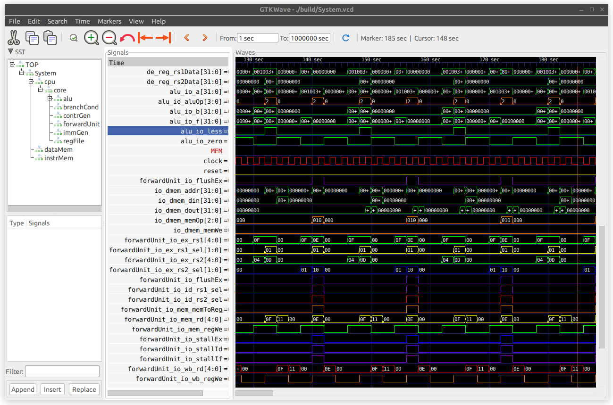

# RISwitch 软件仿真和配套开发环境

## 功能和环境要求

1. CPipe CPU RTL 生成
    - Ubuntu GNU/Linux 22.04
    - [mill](https://github.com/com-lihaoyi/mill): Scala/Chisel build tool
    - GNU Make

2. NVDL 仿真和虚拟上板
    - GCC >= 11
    - Verilator >= 5.014
    - GTKWave
    - Python3

3. AM 应用程序开发
    - LLVM >= 11
    - gcc-riscv64-linux-gnu (参照 PA 讲义或实验 12 讲义手动修改头文件)
    - Python3

## 环境配置

请在克隆仓库后在 `~/.bashrc` 中正确添加以下环境变量

```sh
export NEMU_HOME=/path/to/riswitch-repo/nemu
export AM_HOME=/path/to/riswitch-repo/abstract-machine
export NAVY_HOME=/path/to/riswitch-repo/navy-apps
export NPC_HOME=/path/to/riswitch-repo/npc
export NVBOARD_HOME=/path/to/riswitch-repo/nvboard
export SWITCH_HOME=/path/to/riswitch-repo/riswitch
```

## 目录概述

和 PA 相同的部分请参考 PA 讲义

```
.
├── README.md
├── Makefile
├── init.sh
├── abstract-machine
├── am-kernels // Test programs
├── fceux-am // NES emulator
├── nanos-lite // NJUOS
├── navy-apps // Apps running on nanos-lite
├── nemu
├── nvboard // NJU Virtual Board
└── riswitch // RTL
    ├── build.sc // Chisel build file for CPipe CPU
    ├── constr // Constrains for NVBoard and Nexys-A7
    ├── CPipe // CPipe CPU (Chisel)
    ├── CPipe.xpr // Vivado Project for CPipe
    ├── csrc // Cpp sources for emulation
    ├── doc // Documentation
    ├── icon
    ├── include // Cpp Headers
    ├── Makefile // Main Makefile
    ├── resources // Memory images, ...
    ├── scripts // Scripts for NVDL build
    ├── tests // Testbenches
    ├── top // Top module for FPGA and NVBoard
    ├── utils // Tools for building
    ├── vsrc // Verilog Design RTL
    └── vsrc_gen // Generated Verilog RTL from Chisel
```

## 使用 NVDL 进行测试

1. 原理：`tests` 中每一个文件夹对应一个测试，每个测试需要编写一个 C++ Wrapper 来操纵和检查 dut 的行为。在 `Makefile` 中指定了当前 test 相关选项后，测试模式下，NVDL 构建系统会从共用的设计文件夹 `vsrc` (Verilog RTL)，`vsrc_gen` (Chisel generated Verilog) 和当前测试对应的文件夹（设为 `tests/test`）中找出所有 `.v`, `.sv` 文件，从 `include`, `tests/test` 中找出所有头文件，从 `csrcs`, `tests/test` 中找出所有 Cpp 和 C 源文件，进行编译，生成的可执行文件位于 `build`，该可执行文件运行时能够使用 NVBoard 虚拟上板，或者生成波形；
2. 流程
    1. 在 Makefile 中指定当前测试和 dut 名称；
    
        ```makefile
        # Used for NVDL, verilog dut. There should be exact one main() in $(TESTS_DIR)/$(TEST_NAME).
        SIM_TOP = System
        # The current active test. Both the C++ testbench and verilog testbench should be in the corresponding directory.
        TEST_NAME = am-test
        ```

    2. 在 riswitch 目录下执行仿真选项
        
        ```sh 
        $ make PLATFORM=NVDL MODE=SIM # 仅仿真并生成波形
        $ make PLATFORM=NVDL MODE=SIM wave # 仿真并打开波形
        ```

        
    
    3. 自动执行官方测试集

        指定测试为 nvdl_batch

        

3. 缺陷

    目前正在解决波形重名导致不重新进行仿真的问题。

## 使用 NVDL 进行虚拟上板

#TODO

## 使用 AM 编写应用程序并生成镜像

