# RISwitch 计算机系统和配套集成开发环境

## 技术指标

1. ISA: rv32i;
2. CPU 主频: 50MHz, 5 段流水线;
3. InstrMem: 128KB;
4. DataMem: 128KB;
5. VGA 彩色模式: 640x480, 64 色;
6. VGA 字符模式: 70x30, ANSI 8 色;
7. 设备工作模式: 未实现中断，还是轮询机制;

## 项目分工

陈佳皓：移植 AM 软件到 `ARCH=riscv32-switch`，如 NTerm，Typing-game，OSLab 等，实现“运行诞生于未来的程序”；

茆弘之：实现五段流水线 CPU CPipe，起草 RISwitch 规约，全系统仿真环境搭建，实现“不停计算的机器”；

宋承柏：实现 DataMem，支持长度不超过 4 字节键码的键盘，字符终端，VGA，七段数码管，开关，LED 等外设，实现“来自外部的声音”；

## 项目特色

本项目的初始目标是在 FPGA 上用 Nanos-lite 启动马里奥，所以以 RISwitch (RISC-V + Switch) 为名，后续因为板上空间不够容纳 LiteNES（虚拟上板，修改内存容量后还是能跑的），时间不够大改 CPU 架构实现 CSR 和特权指令而放弃。

本项目有着十分完备的基础设施，能够通过虚拟上板的方式弥补没有实现串口调试，物理上板综合时间长的问题。值得一提的是，不同于在 `ARCH=native` 或 `ARCH=riscv32-nemu` 上调试 AM 程序后再在板上验证的方式，本项目的虚拟上板同时能够仿真 RTL，在验证软件的同时测试硬件功能正确。因为保证了虚拟设备在时序等方面和硬件完全一致，实现了“只要虚拟上板能跑，物理上板只可能有时序问题，逻辑一定正确”的效果。

### 一键虚拟上板（全系统软件仿真）

本项目的一大特色是，利用 [NVDL](https://github.com/mhz20031217/nju-verilated-digital-lab) 实现了全系统（软件 + 硬件）的虚拟上板验证，能够保证上板时行为和本地仿真完全一致，相当于不带 CSR、不带总线、不带分支预测的 YSYX B 线部分内容。详见[配套软件开发环境](#配套软件开发环境)，[展示](#展示)部分。

### Chisel 硬件设计语言

本次实验使⽤了敏捷硬件设计语⾔ Chisel，借助 Scala 函数式编程语⾔部分，可以在较⾼抽象层次上描述电路的构成，实现“敏捷开发”，详见[流水线 CPU 设计](#流水线-cpu-设计)部分。

### 由 AM 驱动的应用程序集成开发环境

本项目使用了来自 Project-N 的多个子项目：[Abstract-Machine](https://github.com/NJU-ProjectN/abstract-machine), [NVBoard](https://github.com/NJU-ProjectN/nvboard)，实现 AM 的 `ARCH=riscv32-switch` 架构，借助 Verilator 仿真器，实现了软件开发环境。

## RISwitch 计算机系统规约

### Freestanding 裸机运行时环境

指令集为 RV32I，无 fence.i 扩展，无 zicsr 扩展；

#### 地址空间 与 设备规约

所有非对齐访存行为为 UB。

以下所有范围为左闭右开。

1. 指令存储器: ROM, 只支持 4 字节对齐访存，大小 128KB，地址空间 0x80000000 ~ 0x80020000；
2. 数据存储器: RAM, 支持所有 RV32I 访存类型，大小 128KB，地址空间 0x80100000 ~ 0x80120000；
3. MMIO 区域

    MMIO 区域只支持 4 字节对齐访存（且只能读取/写入 4 字节），由 AM 软件实现保证这一点。

    UPD 2023.12.02: 除了字符显存部分必须 2 字节访存。
    UPD 2023.12.20: 还有 VGA Framebuffer 必须 1 字节访存。

    1. 七段数码管输出寄存器: 大小 4B，地址空间 0x80200000 ~ 0x80200004，只写，行为为当向这个设备寄存器写入后，7 段数码管会保存并一直 32 位无符号数的 16 进制表示，直到该端口被写入新内容；
    2. 键盘按键输入寄存器：大小 4B，地址空间 0x80500000 ~ 0x80500004，只读，内容为待读取的 1 个完整的 PS/2 通码或断码（意味着需要维护一个缓冲区，每次读取出队，如果缓冲区溢出可以 reset），不支持超过 32 位的键盘码（比如 <kbd>Pause/Break</kbd>, <kbd>PrtScn</kbd>）。比如：快速按下 A 键，按下 B 键，松开 A 键，松开 B 键，这个寄存器的 32 位值在四次读取的时候为 0x0000001C，0x00000032，0x0000F01C，0x0000F032；
    UPD 2023.12.02: 如果当前没有字符输出，该寄存器为全 0；
    3. 时钟输入寄存器：大小 8B，地址空间 0x80300000 ~ 0x80300008，只读，内容为 64 位无符号数，代表从开机起经过的微秒 ($10^{-6}\mathrm{s}$) 数。由于需要分两次读取，规定软件通过 CPU 读取整个寄存器时必须先读取低 32 位，再读取高 32 位。时钟设备保证以这样的行为访问时钟寄存器，高地址读取结果是读取低地址时的高 32 位；
    4. 字符显存缓冲区（只允许 2 字节访存）：大小 32 * 70 * 2B，地址空间 0x80400000 ~ 0x80401180，只写，对应一个 30 行x70 列的屏幕（为了简化地址计算，行数向上对齐到 32），列优先存储。每个 2B 中，低字节为字符 ASCII 码，高字节为颜色（只有低 6 位有效，其中，前景色为 [2:0]，背景色为 [5:3]，分别支持 8 种颜色，颜色编码详见 `riswitch/resources/vga_color.txt`）；
    5. VGA 显存缓冲区（暂不实现）：大小 512x640 * 2B = 655360B，地址空间 0x80800000 ~ 0x808A0000，只写，对应一个 480 行x 640 列的屏幕（行数向上对齐到 512）。
    6. 显示模式控制寄存器：大小 4B，地址空间 0x80500000 ~ 0x80500004，只写，最低位为 0，选择字符渲染器结果输出，最低位为 1，选择显存输出；
    7. 开关寄存器：大小 4B，地址空间 0x80600000 ~ 0x80600004，只读，低 2 字节有效，对应开关 `SW[15:0]`；
    8. LED 寄存器：大小 4B，地址空间 0x80700000 ~ 0x80700004，只写，低 2 字节有效，对应 `LED[15:0]`，行为为：写入后保持写入内容的状态，直到下一次写入；
    9. VGA 显示模式寄存器：大小 4B，地址空间 0x80e00000 ~ 0x80e00004，只写，通过写入 1 值，设置输出模式为字符显存，写入 0，设置输出模式为 VGA Framebuffer，初始为 0，即 VGA Framebuffer。
    10. VGA Framebuffer：大小 512 * 640 * 1B，地址空间 0x80800000 ~ 0x808a0000，只写，对应一个 640x480 的屏幕（行数向上取整到 512），每个 2B 代表 8 位颜色 {2'b0, red[1:0], green[1:0], blue[1:0]}。只有低 6 位有效，一共支持 64 种颜色。

#### 程序的内存映像

本节规定如何加载一个程序镜像到存储器，以及程序如何开始运行和结束。

1. `.text` 节

    `.text` 节单独成段，将被加载到指令存储器，从 0x80000000 开始，其中 `entry`（第一条指令）位于 0x80000000 位置。

2. `.data`, `.rodata`, `.bss` 节

    `.data`, `.rodata`, `.bss` 和其他节将组成一段，被加载到 0x80100000 位置。

3. 程序如何开始

    从 `entry` 开始逐条指令运行，程序自行设置栈、堆等常见的存储区域；

4. 程序如何结束

    程序永不结束，如果执行了未实现的指令，行为为 UB；

### AM 抽象计算机 和 AM 上的 C 语言运行时环境

AM 本身是一台“抽象计算机”，但可以起到 RISwitch 计算机系统的“驱动程序”的作用，提供基本的 C 语言运行时。

#### 实现细节

1. 栈在哪里？

    栈底在数据存储器中，`.bss` 节后面 4KB 对齐的位置再加上 32KB。（意味着局部数组不能过大）；

2. 堆在哪里？

    堆在数据存储器中，从栈底开始向上增长；

3. 程序如何开始

    `start.S` 的 `_start` 函数作为 `entry`，根据链接器导出的符号设置栈指针，然后调用 AM 应用程序的 `main` 函数；

    函数签名 `void main(const char *)`，该函数不能返回，否则行为为 UB；

4. 程序如何结束

    程序通过调用 AM 的 `halt(int code)` 函数结束，将返回值设置为 `code`；

#### 提供的寄存器

AbstractMachine 作为计算机，提供一些寄存器—— C 语言结构体用于读取和写入。

由于 FPGA 上的设备较为特殊，和 AM 实现的寄存器不尽相同，因此更改了 AM 寄存器的定义，放在 `$AM_HOME/am/include/amdev.h` 中，标准的 AM 程序不会使用这些特殊的寄存器。

##### 定义

```c 
/* @member present: whether timer module is present
 * @member has_rtc: whether real time clock is present */
AM_DEVREG( 4, TIMER_CONFIG, RD, bool present, has_rtc);
AM_DEVREG( 5, TIMER_RTC,    RD, int year, month, day, hour, minute, second);
/* @member us: microseconds passed since bootup */
AM_DEVREG( 6, TIMER_UPTIME, RD, uint64_t us);
/* @member present: whether keyboard is present */
AM_DEVREG( 7, INPUT_CONFIG, RD, bool present);
/* @member keydown: whether one of the keys is pressed
 * @member keycode: AM Keycode for the pressed key */
AM_DEVREG( 8, INPUT_KEYBRD, RD, bool keydown; int keycode);
/* @member vmemsz: the size of video memory, draw ops should be within this range. */
AM_DEVREG( 9, GPU_CONFIG,   RD, bool present, has_accel; int width, height, vmemsz);
/* @member ready: always true on most of ARCHs */
AM_DEVREG(10, GPU_STATUS,   RD, bool ready);
/* Draw a row-first w x h rectangle of pixels at (x, y) */
AM_DEVREG(11, GPU_FBDRAW,   WR, int x, y; void *pixels; int w, h; bool sync);

/* RISwitch Specific */
/* @member value: next value to show on 7-seg display */
AM_DEVREG(25, SEG,          WR, uint32_t value);
/* @member value: current value of switches */
AM_DEVREG(26, SWITCH,       RD, uint16_t value);
/* @member value: next value to show on LED */
AM_DEVREG(27, LED,          WR, uint16_t value);
/* @member present: whether char-based memory is present 
 * @member width: the width of cmem (in chars)
 * @member heigth: the height of cmem (in chars) */
AM_DEVREG(28, CMEM_CONFIG,  RD, bool present; int width, height);
/* Put a char ASCII on (x, y) (starting from 0) with fg_color FG and bg_color BG. */
AM_DEVREG(29, CMEM_PUTCH,   WR, int x, y; char ascii; uint8_t fg, bg);
AM_DEVREG(30, SERIAL_PUTCH, WR, char ch);
/* @member mode: 0 for CMEM, 1 for VGA */
AM_DEVREG(31, VGACTRL,      WR, uint8_t mode);
```

##### 使用示例

1. 读取当前按键

```c
/* fceux-am/src/drivers/sdl/input.c */
static void KeyboardCommands ()
{
	// get the keyboard input
  int keycode;
  do {
#define KEYDOWN_MASK 0x8000
    AM_INPUT_KEYBRD_T ev = io_read(AM_INPUT_KEYBRD);
    assert(ev.keycode < 256);
    keycode = ev.keycode;
    g_keyState[keycode] = ev.keydown;
    if (keycode == AM_KEY_ESCAPE || keycode == AM_KEY_Q) halt(0);
  } while (keycode != AM_KEY_NONE);

	// Toggle throttling
	NoWaiting &= ~1;
}
```

2. 等待一段时间

```c
void delay(uint32_t us) {
  uint64_t st = io_read(AM_TIMER_UPTIME).us;
  while (io_read(AM_TIMER_UPTIME).us - st < us);
}
```

3. 字符显存写入

```c
int xPos, yPos;
char ch;
unsigned char fg, bg;
io_write(AM_CMEM_PUTCH, .x = xPos, .y = yPos, .ascii = ch, .fg = fg, .bg = bg);
```

##### FAQ

1. 键盘码：从真正的键盘码转换到 AM 的键盘码的操作由 AM 完成，详见 `abstract-machine/am/src/riscv/switch/input.c`。

2. 字符显存颜色：和下层硬件实现保持一致，见 `riswitch/resources/vga_color.txt`，一共 8 行，对应 `fg`, `bg` 为 `0~8` 的情况，本项目要求实现支持 ANSI 前 8 种颜色的终端。

#### 可使用的库函数

见 `$AM_HOME/klib/include/klib.h`；

## 配套软件开发环境

本节是“一键虚拟上板”的介绍，读者可以克隆本仓库，在自己的电脑上生成 CPU 代码、虚拟上板，或者用 Vivado 生成 Bitstream，在板上运行。

### 功能和环境要求

本项目的仿真框架由 [NVDL - NJU Verilated Digital Lab]() 魔改而来，支持 NVDL 提供的分模块、多测试 Verilator + GTKWave 或 Vivado 仿真，和单一顶层模块的 Verilator + NVBoard 虚拟上板。

1. CPipe CPU RTL 生成（Scala 开发环境和 mill）
    - Ubuntu GNU/Linux 22.04
    - [mill](https://github.com/com-lihaoyi/mill): Scala/Chisel build tool
    - GNU Make

2. NVDL 仿真和虚拟上板
    - GCC >= 11
    - Verilator >= 5.014
    - GTKWave
    - Python3

3. AM 应用程序开发
    - LLVM >= 11
    - gcc-riscv64-linux-gnu (参照 PA 讲义或实验 12 讲义手动修改头文件)
    - Python3

### 环境配置

请在克隆仓库后在 `~/.bashrc` 中正确添加以下环境变量

```sh
export NEMU_HOME=/path/to/riswitch-repo/nemu
export AM_HOME=/path/to/riswitch-repo/abstract-machine
export NAVY_HOME=/path/to/riswitch-repo/navy-apps
export NPC_HOME=/path/to/riswitch-repo/npc
export NVBOARD_HOME=/path/to/riswitch-repo/nvboard
export SWITCH_HOME=/path/to/riswitch-repo/riswitch
```

### 目录概述

和 PA 相同的部分请参考 PA 讲义

```
.
├── README.md
├── Makefile
├── init.sh
├── abstract-machine
├── am-kernels // Test programs
├── fceux-am // NES emulator
├── nanos-lite // NJUOS
├── navy-apps // Apps running on nanos-lite
├── nemu
├── nvboard // NJU Virtual Board
└── riswitch // RTL
    ├── build.sc // Chisel build file for CPipe CPU
    ├── constr // Constrains for NVBoard and Nexys-A7
    ├── CPipe // CPipe CPU (Chisel)
    ├── CPipe.xpr // Vivado Project for CPipe
    ├── csrc // Cpp sources for emulation
    ├── doc // Documentation
    ├── icon
    ├── include // Cpp Headers
    ├── Makefile // Main Makefile
    ├── resources // Memory images, ...
    ├── scripts // Scripts for NVDL build
    ├── tests // Testbenches
    ├── top // Top module for FPGA and NVBoard
    ├── utils // Tools for building
    ├── vsrc // Verilog Design RTL
    └── vsrc_gen // Generated Verilog RTL from Chisel
```

### 使用 NVDL 进行测试

1. 原理：`tests` 中每一个文件夹对应一个测试，每个测试需要编写一个 C++ Wrapper 来操纵和检查 dut 的行为。在 `Makefile` 中指定了当前 test 相关选项后，测试模式下，NVDL 构建系统会从共用的设计文件夹 `vsrc` (Verilog RTL)，`vsrc_gen` (Chisel generated Verilog) 和当前测试对应的文件夹（设为 `tests/test`）中找出所有 `.v`, `.sv` 文件，从 `include`, `tests/test` 中找出所有头文件，从 `csrcs`, `tests/test` 中找出所有 Cpp 和 C 源文件，进行编译，生成的可执行文件位于 `build`，该可执行文件运行时能够使用 NVBoard 虚拟上板，或者生成波形；
2. 流程
    1. 在 Makefile 中指定当前测试和 dut 名称；
    
        ```makefile
        # Used for NVDL, verilog dut. There should be exact one main() in $(TESTS_DIR)/$(TEST_NAME).
        SIM_TOP = System
        # The current active test. Both the C++ testbench and verilog testbench should be in the corresponding directory.
        TEST_NAME = am-test
        ```

    2. 在 riswitch 目录下执行仿真选项
        
        ```sh 
        $ make PLATFORM=NVDL MODE=SIM # 仅仿真并生成波形
        $ make PLATFORM=NVDL MODE=SIM wave # 仿真并打开波形
        ```

        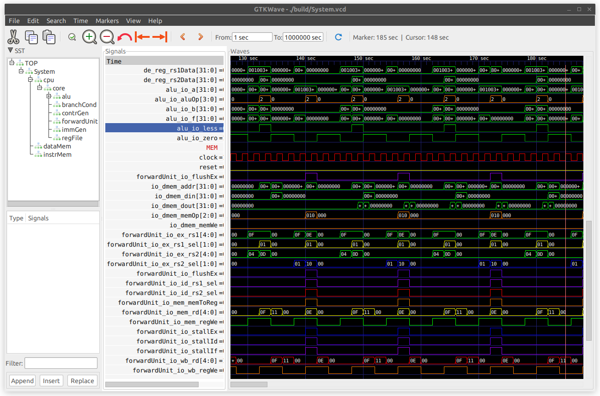
    
    3. 自动执行官方测试集

        指定测试为 nvdl_batch

        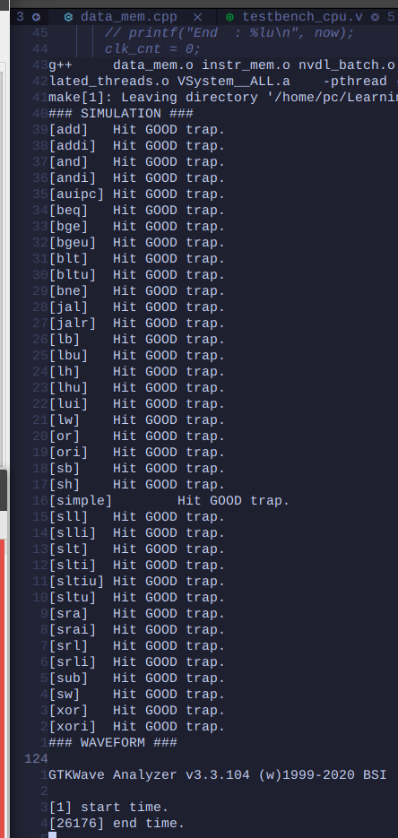

### 使用 NVDL 进行虚拟上板

#### NVDL 主 Makefile 介绍

NVDL 和 Vivado 的逻辑类似。上板时只有一个 Top Module，是 `riswitch/top/top.sv:top`。测试可以有多个，对应着 `riswtich/tests` 中的各个文件夹。

当在命令行中指定 `MODE=SIM` 时，是测试模式，构建系统将取出 `vsrc`, `vsrc_gen` （对应 Design Sources）中的 Verilog 文件，以及 `tests/$(TEST_NAME)` 中的 Verilog 文件（对应 Simulation Sources）进行编译。在 `csrc` 和 `tests/$(TEST_NAME)` 中的 C, Cpp 文件用于 NVDL 仿真或上板。

在使用 RISwitch 开发环境时，进行 AM 程序的仿真（仅判断是否 Hit Good Trap，生成波形），请将 `TEST_NAME` 设置为 `am-test`，指定 `MODE=SIM`。使用 NVBoard 进行虚拟上板，没有设置需要修改，指定 `MODE=EVAL` 即可。

##### 选项

NVDL 还没有加入 KConfig 等配置系统，目前各个配置选项都在 Makefile 中直接修改。以下是和 RISwitch 仿真环境有关的选项。

```Makefile
TEST_NAME = am-test # 指定测试在文件夹 tests/$(TEST_NAME) 中
SIM_TOP = System # 无需改动，对应着 System 模块
SIM_TB = ? # 如果需要用 NVDL 启动 Vivado 测试某一个模块，需要设置 TEST_NAME，并在此指定 Testbench 模块名，如果是直接建立 Vivado 工程文件来测试，没有使用 NVDL 构建系统，此选项无效
EVAL_TOP = top # 无需改动。对应着虚拟/真实上板时使用的 NVDL 通用顶层模块
CLOCK_TYPE = PERF # 无需改动，本项目使用最高频率的时钟（降频不发生在 NVDL 层面）
```

##### 已有的测试

测试分为两种，一种是能在 NVDL 仿真环境中跑的，另一种就是 Vivado 中的 Testbench。

1. am-test: 不在 RISwitch 文件夹下直接使用，在 AM 项目中使用 `make ARCH=riscv32-switch sim` 构建。

2. nvdl_batch: 移植了课程提供的 RISC-V 官方 Cpu 测试集到 NVDL。
3. cpu_pipebatch: 即课程提供的官方测试集，可以在 Vivado 中测试 Cpu。

#### 使用示例

##### 使用 NVDL 仿真测试某一个单独的模块

该模块设计文件位于 `riswitch/vsrc/my_module.sv:my_module`，测试使用的 C++ Wrapper 和（可以没有，在 C++ 中直接例化模块）Verilog Testbench 位于 `riswitch/tests/my_test/`。

（以下是 C++ Wrapper 直接例化模块的方式）

（注意，是否生成波形取决于 C++ Wrapper，判定 Hit trap 也取决于 C++ Wrapper，仿真何时停止也取决于 C++ Wrapper）

（如果生成波形，请确保波形名和 `SIM_TOP` 一致，以便 NVDL 的 `wave` 目标正常工作）

1. 在 Makefile 中修改 `SIM_TOP = my_module`，`TEST_NAME = my_test`。
2. 在 `riswitch` 文件夹下，执行

    ```sh
    $ make PLATFORM=NVDL MODE=SIM # 仿真，不自动打开波形
    $ make PLATFORM=NVDL MODE=SIM wave # 仿真，自动打开波形（如果 C++ Wrapper 没有输出波形则失败）
    ```

    进行仿真。

##### 使用 Vivado 仿真测试某一个单独的模块

目前 NVDL 只加入了 Vivado 仿真功能，不支持生成 Bitstream 和上板。

和上个示例中模块的位置相同，添加了 Verilog Testbench `tests/my_test/TB.sv:TB`。在 Makefile 中设置 `SIM_TB = TB`，`TEST_NAME` 不变。

在 `riswitch` 文件夹下，执行

```sh
$ make PLATFORM=VIVADO MODE=SIM # 仿真，不自动打开波形
$ make PLATFORM=VIVADO MODE=SIM wave # 仿真，自动打开波形
```

至于如何绕过 NVDL 在 Vivado 上直接仿真，新建工程，手动添加文件即可。

### 使用 AM 编写应用程序并生成镜像

设置好环境变量后，在应用程序代码目录中写 Makefile，指定名称和源文件，并包含 AM 主 Makefile；

这里需要注意的是，应用程序代码目录可以在任意位置，和 AM 主 Makefile 的接口最小只有两个列表变量：`NAME` 和 `SRCS`，还可以自行添加 `INCLUDE`，`CFLAGS` 等。

```makefile
NAME = coremark # name of AM app
SRCS = $(shell find src/ -name "*.c") # list of sources
include $(AM_HOME)/Makefile # include main Makefile
```

其他 Makefile 内容可以自行添加，但必须包含以上内容

编译时，可以先在 `ARCH=native` 和 `ARCH=riscv32-nemu` 上调试通过，然后指定 `ARCH=riscv32-switch` 自动生成内存镜像。

比如，Debug 时，先调试运行

```sh
$ make ARCH=native run
```

Debug 结束，仿真或上板时，运行

```sh
$ make ARCH=riscv32-switch # 仅生成镜像
$ make ARCH=riscv32-switch sim # 生成镜像并调用 NVDL 当前 Testbench 仿真
```

生成镜像的步骤在生成 ELF 文件的基础上，分别拷出了 `TEXT` 和 `DATA` 两个段，然后用 Python 脚本转换到 `.hex` 内存镜像。

生成时，可以看到 InstrMem 和 DataMem 的使用量

```sh
$ make ARCH=riscv32-switch
# Building amtest-image [riscv32-switch]
+ CC src/main.c
...
+ LD -> build/amtest-riscv32-switch.elf
Memory region         Used Size  Region Size  %age Used
             ROM:        9084 B       128 KB      6.93%
             RAM:       77084 B       128 KB     58.81%
# Creating image [riscv32-switch]
+ OBJCOPY -> build/amtest-riscv32-switch.bin
+ OBJCOPY -> build/amtest-riscv32-switch_d.bin
+ HEXGEN -> build/amtest-riscv32-switch.hex (InstrMem Image)
+ HEXGEN -> build/amtest-riscv32-switch_d.hex (DataMem Image)
```

需要注意的是，`ARCH=native`, `ARCH=riscv32-nemu` 和 `ARCH=riscv32-switch` 上的设备不尽相同，在 NVDL 仿真（不使用 NVBoard 虚拟上板）时，如字符显存等设备不能使用，需要改用 `printf` 调试法输出。 

### 使用 NVDL 进行 AM 程序的仿真和上板

#### 仿真（此功能一般是硬件开发人员使用）

有一个 AM 程序，它的 Makefile 在 `am-kernels/kernels/my_program/Makefile`，这个 Makefile 已经根据上文要求写好，并且能在 `ARCH=native` 等架构上编译成功。

1. 设置 NVDL Makefile `riswitch/Makefile`，`TEST_NAME = am-test` （已写好，用于加载 AM 程序，仿真并生成波形）

2. 在 `am-kernels/kernels/my_program/` 下，执行

    ```sh
    # 阅读 abstract-machine/scripts/platform/switch.mk 详细了解各个目标
    $ make ARCH=riscv32-switch # 编译并生成 IMEM_IMG 和 DMEM_IMG
    $ make ARCH=riscv32-switch sim # 仿真，不自动打开波形（只有 Hit Trap 提示）
    $ make ARCH=riscv32-switch wave # 仿真并自动打开波形
    $ mkae ARCH=riscv32-switch cleansim # 只删除仿真可执行文件和波形
    ```

#### 虚拟上板（此功能一般是 AM 软件开发人员使用）

AM 程序和上文一样。

首先，配置是否生成波形（建议运行时长超过 10s 的程序都不要生成波形，否则磁盘空间满）

在 `riswitch/include/common.hpp` 中，注释掉 `#define CONFIG_TRACE` 关闭波形生成。

在 `am-kernels/kernels/my_program/` 下，执行

```sh
# 阅读 abstract-machine/scripts/platform/switch.mk 详细了解各个目标
$ make ARCH=riscv32-switch eval # 虚拟上板
$ make ARCH=riscv32-switch evalwave # 虚拟上板，结束后自动打开波形
```

以下是效果展示

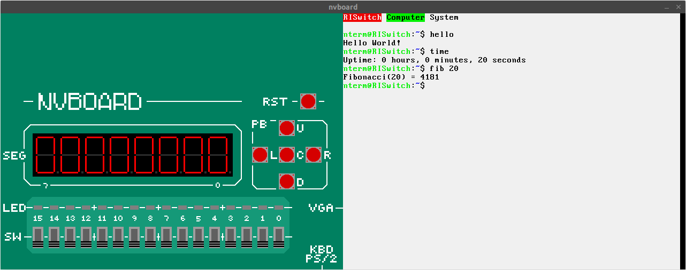

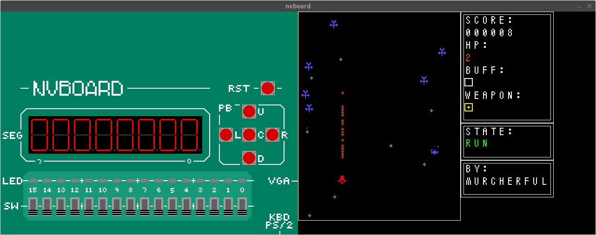

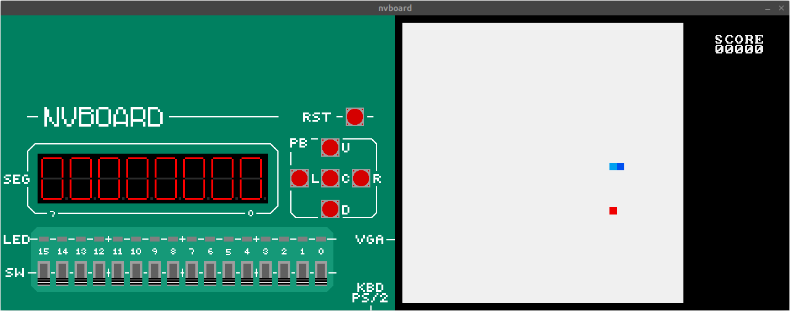

#### 自动生成 Vivado 存储器 IP 核使用的 COE 文件

在 AM 程序文件夹下，执行

```sh
$ make ARCH=riscv32-switch vivado # 生成 COE 文件，并由 NVDL Makefile 放在 Vivado 指定的位置
```

## 流水线 CPU 设计

### 五段流水线设计

<center>
  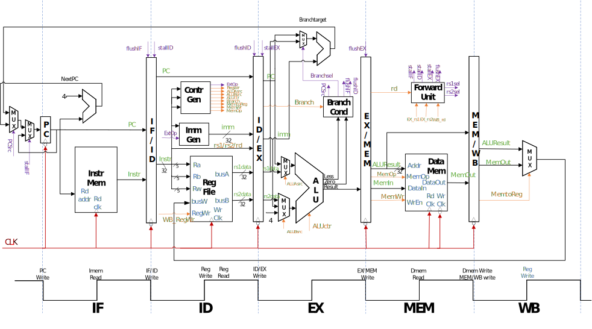

  图：分模块设计和架构图
</center>

<center>
  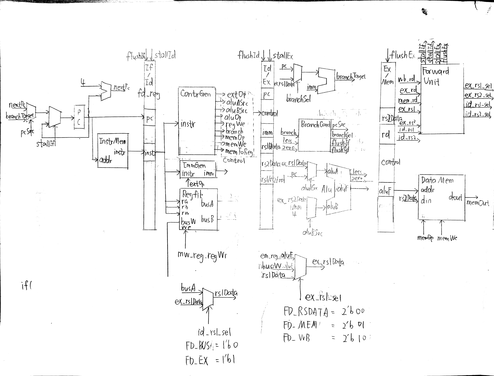

  图：修改后的设计（包含转发机制）
</center>


### 冲突冒险处理

ForwardUnit 根据 EX 阶段和 MEM, WB 阶段寄存器编号的情况决定转发的来源，在 load-use 的情况下生成流水线阻塞和冲刷的信号。

`ex_rs?_sel`: 选择转发到 EX 阶段的数据来源，取值为

```scala
  val FD_RSDATA = "b00".U(2.W)
  val FD_MEM    = "b01".U(2.W)
  val FD_WB     = "b10".U(2.W)
```

公式为

```scala
  io.ex_rs?_sel := Mux(
    io.mem_rd === io.ex_rs? && io.mem_regWe,
    FD_MEM,
    Mux(io.wb_rd === io.ex_rs? && io.wb_regWe, FD_WB, FD_RSDATA)
  )
```

`stallIf`, `stallId`, `stallEx`, `flushEx`: 阻塞和冲刷信号，用于 load-use 冒险，取值为

```scala
  val FD_BUS    = 0.U(1.W)
  val FD_EX     = 1.U(1.W)
```

公式为

```scala
  val load_use =
    (io.mem_memToReg && 
      (io.ex_rs1 === io.mem_rd || io.ex_rs2 === io.mem_rd))
```

### “抄手册”宏

mhz 在在暑假了解了更多软件工程相关的知识后，认为设计应该便于修改，且做到“代码即注释”。在 ICS PA 中做了 riscv32-nemu 后，学到了“抄手册宏”，如下图所示

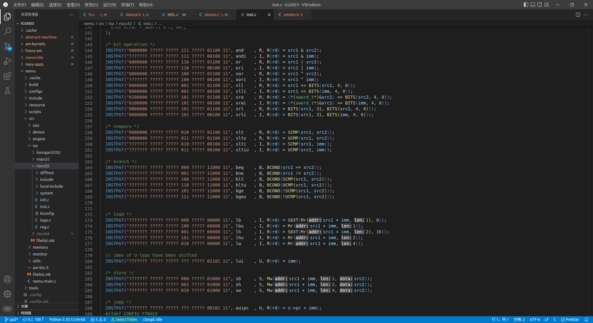

如果能够在数电实验中实现“抄手册宏”，那么工作量会大大减轻，出现 Bug 时也能够迅速定位——只要阅读“注释”就好了。

利用 Chisel 的 ListLookup API，能够便捷地实现指令译码。

指令格式这样定义


```scala
object Instructions {
  def LUI   = BitPat("b?????????????????????????0110111")
  def AUIPC = BitPat("b?????????????????????????0010111")
  // rArith
  def ADD   = BitPat("b0000000??????????000?????0110011")
  def SUB   = BitPat("b0100000??????????000?????0110011")
  ...
```

定义查找表

```scala
  //                                      memToReg memOp                valid
  //            aluASrc aluBSrc aluCtr regWe | memWe |   extOp  branch    |
  val default = // |      |       |       |  |  |    |      |      |      |
             List(A_X  , B_X  , ALU_X   , N, N, N, M_X  , EOP_X, BR_N,    N)
  val map = Array(
    LUI   -> List(A_X  , B_IMM, ALU_SRCB, Y, N, N, M_X  , EOP_U, BR_N,    Y),
    AUIPC -> List(A_PC , B_IMM, ALU_ADD , Y, N, N, M_X  , EOP_U, BR_N,    Y),
    JAL   -> List(A_PC , B_4  , ALU_ADD , Y, N, N, M_X  , EOP_J, BR_JAL,  Y),
    JALR  -> List(A_PC , B_4  , ALU_ADD , Y, N, N, M_X  , EOP_I, BR_JALR, Y),
    BEQ   -> List(A_RS1, B_RS2, ALU_SLT , N, N, N, M_X  , EOP_B, BR_BEQ,  Y),
    BNE   -> List(A_RS1, B_RS2, ALU_SLT , N, N, N, M_X  , EOP_B, BR_BNE,  Y),
  ...
```

下文这样匹配

```scala
  val contr = ListLookup(io.instr, Control.default, Control.map)

  io.aluASrc  := contr(0)
  io.aluBSrc  := contr(1)
  ...
```

在后续实现外设时钟时，发现讲义提供的设计控制信号不够充分：scb 提出当读取 64 位时钟寄存器时，需要区分是不是在读取、是在读取高 32 位还是低 32 位，因此需要增加读使能信号。添加这个功能，只花了 1min 在查找表中添加一列、20s 编译生成 Verilog 就完成了。

### 函数式编程简化桶形移位器实现

```scala
// Adapted from YSYX PPT: https://ysyx.oscc.cc/slides/2306/13.html#/chisel%E9%87%8D%E7%A3%85%E7%A6%8F%E5%88%A9
class BarrelShift(w: Int) extends Module {
  val io = IO(new Bundle {
    val in      = Input(UInt(w.W))
    val shamt   = Input(UInt(log2Up(w).W))
    val isLeft  = Input(Bool())
    val isArith = Input(Bool())
    val out     = Output(UInt(w.W))
  })
  val leftIn = Mux(io.isArith, io.in(w - 1), false.B) // 右移时从左边移入的位
  def layer(din: Seq[Bool], n: Int): Seq[Bool] = { // 描述第n级选择器如何排布
    val s = 1 << n // 需要移动的位数
    def shiftRight(i: Int) = if (i + s >= w) leftIn else din(i + s) // 描述右移时第i位输出
    def shiftLeft(i:  Int) = if (i < s) false.B else din(i - s) // 描述左移时第i位输出
    val sel = Cat(io.isLeft, io.shamt(n)) // 将移位方向和移位量作为选择器的选择信号
    din.zipWithIndex.map {
      case (b, i) => // 对于每一位输入b,
        VecInit(b, shiftRight(i), b, shiftLeft(i))(sel)
    } // 都从4种输入中选择一种作为输出
  }
  def barrelshift(din: Seq[Bool], k: Int): Seq[Bool] = // 描述有k级的桶形移位器如何排布
    if (k == 0) din // 若移位器只有0级, 则结果和输入相同
    // 否则实例化一个有k-1级的桶形移位器和第k-1级选择器, 并将后者的输出作为前者的输入
    else barrelshift(layer(din, k - 1), k - 1)
  io.out := Cat(barrelshift(io.in.asBools, log2Up(w)).reverse) // 实例化一个有log2(w)级的桶形移位器
}
```

### 使用 Bundle 和重连语义简化流水段寄存器的实现

使用 Verilog 实现流水段寄存器是一件比较麻烦的事情。如果不为流水段寄存器设计一个 Module，那么在 CPU 顶层模块中将出现大量单独的信号定义。即使用讲义推荐的方式，将各个字段拼接后“打包”，各个信号仅仅以下标为标识，不易记忆，如果需要添加或删除字段，又需要进行大量的删改。如果单独增加一个 Module，那么连线将是一件体力活，而且容易出错。Verilog 中的信号不能嵌套，这会导致 ID/EX, EX/MEM 寄存器中大量相同的控制信号都需要一一连接（对于一条指令，控制信号是相同的）。

在 ContrGen 模块中，定义了控制信号 Bundle

```scala
class ContrSignals extends Bundle {
  val aluASrc  = Output(Bool())
  val aluBSrc  = Output(UInt(2.W))
  val aluOp    = Output(UInt(4.W))
  val regWe    = Output(Bool())
  val memToReg = Output(Bool())
  val memRe    = Output(Bool())
  val memWe    = Output(Bool())
  val memOp    = Output(UInt(3.W))
  val branch   = Output(UInt(3.W))
  val valid    = Output(Bool())
}
```

在流水段寄存器中，嵌套一个 `ContrSignals`

```scala
class IdExPipelineRegister(w: Int) extends Bundle {
  ...
  val rs2Data = UInt(w.W)
  val c       = new ContrSignals
}

class ExMemPipelineRegister(w: Int) extends Bundle {
  val aluF    = UInt(w.W)
  val rs2Data = UInt(w.W)
  val rd      = UInt(5.W)
  val c       = new ContrSignals
}
```

后文更新 EX/MEM 寄存器时，控制信号连接只需 1 行

```scala
  when(forwardUnit.io.flushEx) {
    em_reg := 0.U.asTypeOf(em_reg)
    em_reg.c.valid := 1.B
  }.otherwise {
    ...
    em_reg.c       := de_reg.c
  }
```

## 外设的设计

本节介绍本项目中比较复杂和重要的外设，除了下面单独列出的，还有 VGA，七段数码管，LED 和开关。

### 键盘

### 时钟

### 字符终端

在字符终端的设计中，分为 4 个部分：字符显存、字模、渲染器和 VGA 控制器。其中，字符显存能够存储 70x30 的 ASCII 信息，以及相应的前景色、背景色。渲染器中是一个长度为 8 的 Palette，可以用字符显存中的 3 位颜色信息作下标获得当前字符前景、背景色。地址的转换部分，VGA 控制器输出的 $\mathrm{h\_addr}$, $\mathrm{v\_addr}$ 经过变换，得到字符位置和字模位置。

$$
    \mathrm{r\_addr} = \mathrm{v\_addr} \div 16;\quad \mathrm{c\_addr} = \mathrm{h\_addr} \div 9;\\
    \mathrm{ir\_addr} = \mathrm{v\_addr} \% 16;\quad \mathrm{ic\_addr} = \mathrm{ir\_addr} \% 9;
$$

然后分别转发给字符显存和字模，字符显存将当前 ASCII 发给字模，字模输出当前屏幕位置是前景还是背景，发送给渲染器。字符显存将当前的前景色和背景色发送给渲染器，渲染器综合上述信息生成当前像素，发送给 VGA 控制器。

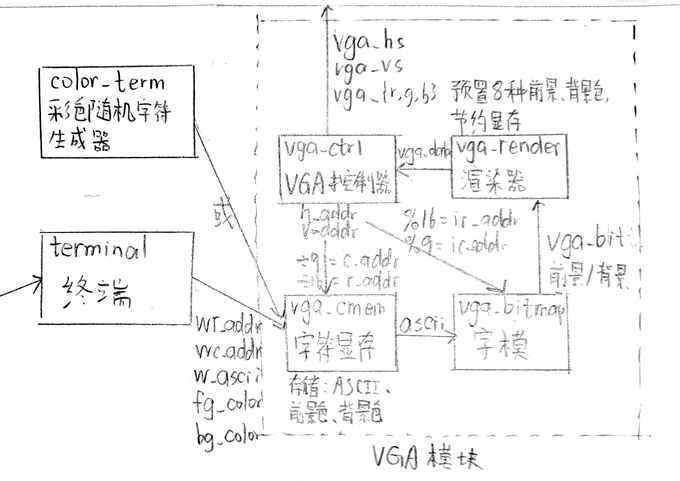

## 软件的设计

### AM `ARCH=riscv32-switch` 的设计

#### AM 寄存器

增加的寄存器大部分只是对相应的地址（定义依照 Spec 放在 `abstract-machine/am/src/platform/switch/include/switch.h`）进行写入或读取，只有对 `AM_INPUT_KEYBRD` 的读取需要进行转换。

还是使用查找表和宏来实现，在不超过 4 字节的键盘码中，辨别是通码还是断码只需要判断第 1 个字节是不是 `0xf0` 即可，然后判断第 1 或 2 个字节是否为 `0xe0`，以此为依据，查找 `lut` 或 `elut`。

#### 整数乘除法

该功能抄袭了 AM `ARCH=riscv32e-npc` 的方式，将 libgcc 中的相应代码包含进来，实现了用加减和移位来实现乘除法，详见 `abstract-machine/am/src/riscv/switch/libgcc`；


```c
#define K(scan, key) [scan] = AM_KEY_##key,

// all keys are set to AM_KEY_NONE by default
static int lut[256] = {
  K(0x1, F9) K(0x3, F5) K(0x4, F3) K(0x5, F1) K(0x6, F2)
  K(0x7, F12) K(0x9, F10) K(0xA, F8) K(0xB, F6) K(0xC, F4)
  K(0xD, TAB) K(0xE, GRAVE) K(0x11, LALT) K(0x12, LSHIFT)
...

static int elut[128] = {
  K(0x1F, APPLICATION) K(0x11, RALT) K(0x27, APPLICATION) K(0x14, RCTRL)
  K(0x70, INSERT) K(0x6c, HOME) K(0x7D, PAGEUP) K(0x71, DELETE)
  K(0x69, END) K(0x7A, PAGEDOWN) K(0x75, UP) K(0x6B, LEFT) 
  K(0x72, DOWN) K(0x74, RIGHT) K(0x5A, RETURN)
};

#undef K

void __am_input_keybrd(AM_INPUT_KEYBRD_T *kbd) {
  uint32_t keycode = inl(KBD_ADDR);
  uint8_t b0 = keycode, b1 = keycode >> 8, b2 = keycode >> 16;

  if (b1 == 0xf0) { // keyup
    kbd->keydown = false;
    kbd->keycode = (b2 == 0xe0) ? elut[b0] : lut[b0];
  } else { // keydown
    kbd->keydown = true;
    kbd->keycode = (b1 == 0xe0) ? elut[b0] : lut[b0];
  }
}
```

### 终端程序的设计

第一版思路是首先开辟存储整个输入文档的空间，同时开辟显示屏大小的窗口（$30\times70$），寄存当前光标之于显示屏的相对位置和之于整个文档的绝对位置，以及目前窗口锁定的“锚点”行（anchor），通过锚点和相对位置的运算结果与绝对位置比较来判断目前光标所处位置是否是文档末，当且仅当条件满足时通过键盘键入时光标和文档长度都会自增，否则此次键入只会改变当前光标所指位置的文档。

为支持方向键操控光标位置，则根据已有的位置参数和键入信号综合判断即可。对于回车键，中途的回车键要求光标后的文档整体位移，可能会造成效率问题，故不支持此功能。回车键仅能在文档末使用，对于每一行文档，记录下该行对应的上一行开头的绝对位置下标和下一行开头的绝对位置下标，便于回车的跳转。这样便可以实现一个简易的键入系统。

第二版的主要动机是对需要实现目的的针对性改进。首先，整个文档的空间太大了，该终端的目的在于键入指令并产生反馈结果。故而其实并不需要那么大的空间，仅需要在窗口内实现所有操作，并滚动显示即可。其余方向键的操作与最开始基本一致。

对于指令的识别，只需要缓存该条指令起始和终止的绝对位置，在输入回车后以此为范围依次进行字符串的读入并转化为相应参数，最后更新状态并准备下一次读入即可。

## 展示

本节展示 RISwitch 计算机系统在仿真和上板时的表现。

### 基础功能 (NTerm)

借助 cjh 移植的 NTerm，软件实现了大小写、换行、退格、多行命令、滚屏、ANSI Escape Code 处理。充分利用了底层硬件提供的 8 种颜色显示的功能。


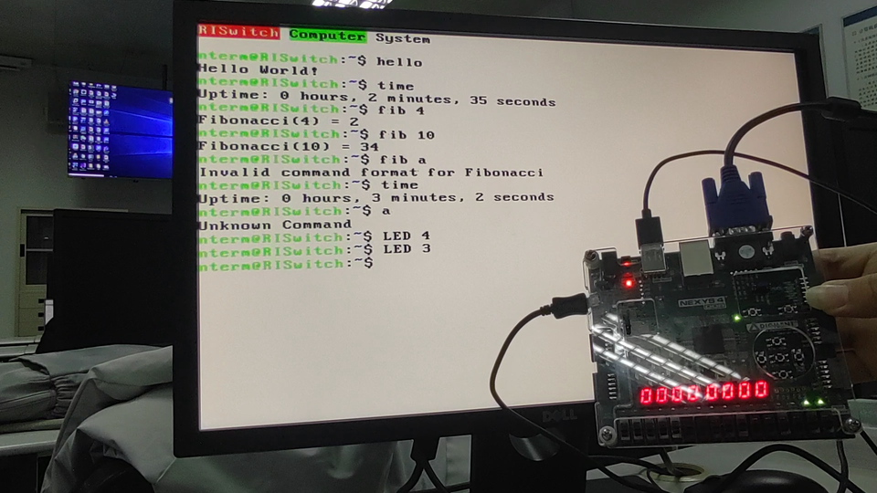

### 扩展功能

由于支持除了串口的所有 AM 设备，扩展功能就是在 FPGA 上运行前人写好的 AM 程序，实现“运行诞生于未来的程序”。

1. Typing-game

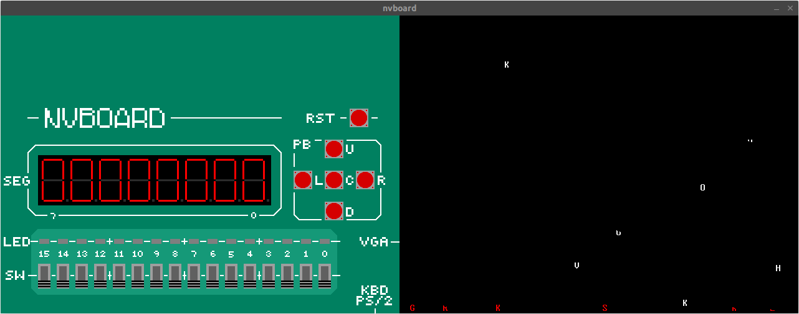

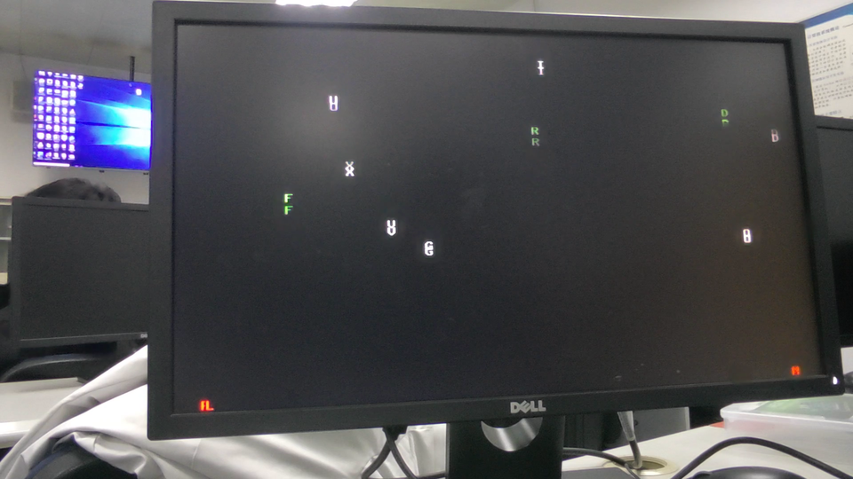

2. 雷电

作者: 171860637


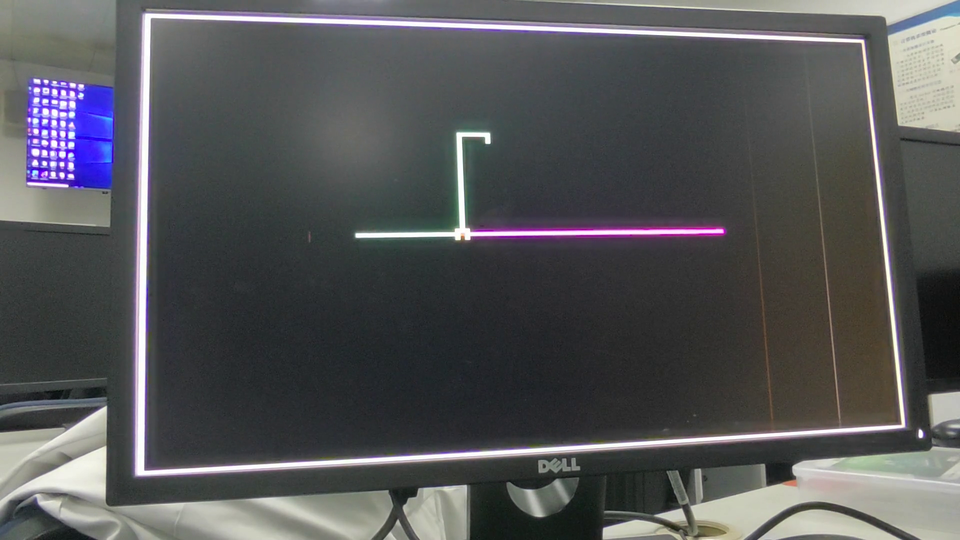

## 实验中遇到的问题和解决方案

### 板上空间不够放下完整的 VGA 显存

减小 VGA 色域，用 2 位表示一个通道，一个像素 6 位，解码时映射到 12 位颜色。

```verilog
module Conventer2b ( // convert 2b color to 4b
  input [1:0] color_2b,
  output [3:0] vga_color
);
assign vga_color =
  (color_2b == 2'b00) ? 4'd0 :
  (color_2b == 2'b01) ? 4'd5 :
  (color_2b == 2'b10) ? 4'd10 :
  (color_2b == 2'b11) ? 4'd15 :
  4'b0;
endmodule
```

### 仿真没有内存限制，但上板有限制，导致仿真行为不一致

链接时加入主存区域划分，在链接脚本中设置内存大小

```ldscript
ENTRY(_start)
PHDRS { text PT_LOAD; data PT_LOAD; }

MEMORY {
  ROM : ORIGIN = 0x80000000, LENGTH = 128K // constrain InstrMem to 128K
  RAM : ORIGIN = 0x80100000, LENGTH = 128K // constrain DataMem to 128K
}

SECTIONS {
  /* _pmem_start and _entry_offset are defined in LDFLAGS */
  . = _pmem_start + _entry_offset;
  .text : {
    *(entry)
    *(.text*)
  } > ROM : text // assign .text to ROM
...
}
```

这样，如果链接时发现内存超限，将直接报错提示，避免 Debug。

```
riscv64-linux-gnu-ld: /home/pc/Learning/02.IT/5.ICS/ics2023/am-kernels/kernels/litenes/build/litenes-riscv32-switch.elf section `.bss' will not fit in region `RAM'
riscv64-linux-gnu-ld: region `RAM' overflowed by 1401328 bytes
Memory region         Used Size  Region Size  %age Used
             ROM:       21076 B       128 KB     16.08%
             RAM:     1532400 B       128 KB    1169.13%
```

上面显示出起 mario 是不可能完成的任务，除非加总线，使用 DDR 内存。
